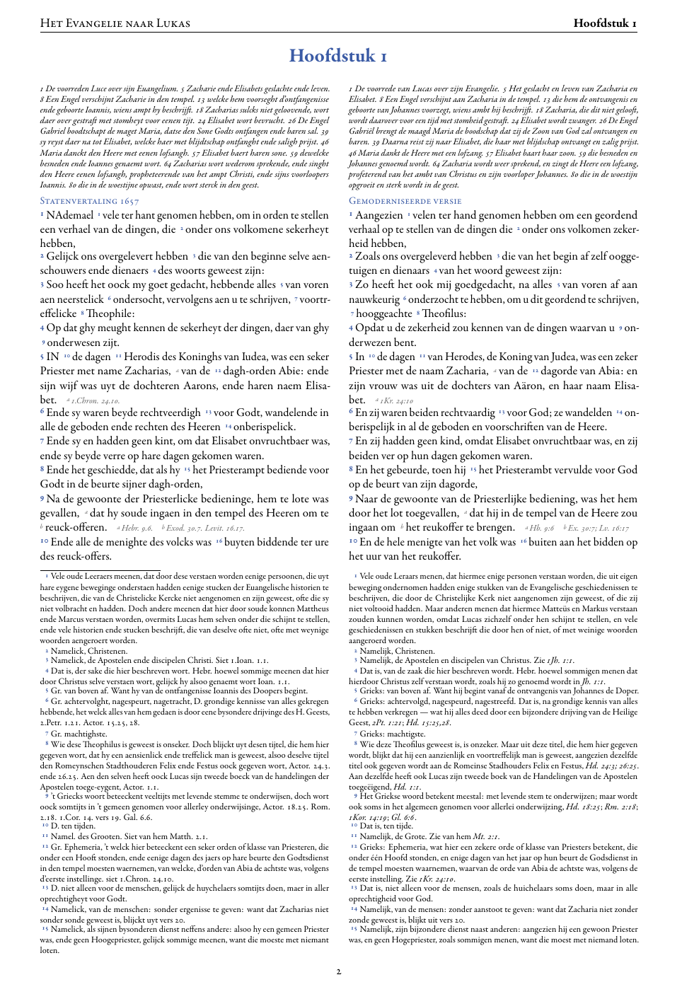

# SVmodernisatie2026

<p align="center">
  
</p>

<object data="parallelbijbel/LUK_voorbeeld.pdf" type="application/pdf" width="100%" height="900">
  <p><a href="parallelbijbel/LUK_voorbeeld.pdf">Open de parallelbijbel-PDF van Lucas.</a></p>
</object>

---

**Modernisering van de Statenvertaling 1657 (2e druk) — met maximaal
behoud van de SV-eigenheid.** Eerste focus: het evangelie naar Lucas
(24 hoofdstukken; de invoer staat klaar in `input.sv/LUK/`).

> **Lees eerst [`MODERNISATIE.md`](MODERNISATIE.md).** Daar staat
> expliciet *wat* modernisatie in dit project is, *wat het niet is*,
> volgens welke methode het gebeurt, en welke aannames daaraan
> ten grondslag liggen. Bij twijfel over reikwijdte of vertaalkeuze is dat
> document leidend — wat er in deze README onder "Wat het project doet"
> staat is een samenvatting daarvan.

---

## Inhoudsopgave

- [Cumulatieve kennisopbouw — wat dit project anders doet](#cumulatieve-kennisopbouw--wat-dit-project-anders-doet)
- [Wat het project doet](#wat-het-project-doet)
- [Snel aan de slag](#snel-aan-de-slag)
- [Architectuur](#architectuur)
  - [Werking per vers](#werking-per-vers)
  - [Batch-orchestrator (orchestrator → subagent)](#batch-orchestrator-orchestrator--subagent)
- [Portabiliteit — andere modellen of uitvoeromgevingen](#portabiliteit--andere-modellen-of-uitvoeromgevingen)
  - [Wat is aanbiedersonafhankelijk (geen wijziging nodig)](#wat-is-aanbiedersonafhankelijk-geen-wijziging-nodig)
  - [Wat is uitvoeromgeving-specifiek (uitvoeromgevingslaag)](#wat-is-uitvoeromgeving-specifiek-uitvoeromgevingslaag)
  - [Wat is model-specifiek](#wat-is-model-specifiek)
  - [Concreet: wat zou je moeten doen om te switchen?](#concreet-wat-zou-je-moeten-doen-om-te-switchen)
  - [Realistische verwachtingen per alternatief](#realistische-verwachtingen-per-alternatief)
- [Projectstructuur](#projectstructuur)
  - [Detail-documentatie](#detail-documentatie)
- [Uitvoerformaat](#uitvoerformaat)
- [Validatie en kwaliteit](#validatie-en-kwaliteit)
  - [Aanvullende linters (deterministisch, snel, geen API-aanroepen)](#aanvullende-linters-deterministisch-snel-geen-api-aanroepen)
  - [Diepere beoordeling (in-context)](#diepere-beoordeling-in-context)
  - [Adversariële beoordeling per hoofdstuk](#adversariële-beoordeling-per-hoofdstuk)
  - [Meta-adversariële review per boek](#meta-adversariële-review-per-boek)
- [Bijbelverwijzingen](#bijbelverwijzingen)
- [Git-workflow](#git-workflow)
  - [Parallelle agent-sessies — worktrees + clash](#parallelle-agent-sessies--worktrees--clash)
  - [Lokale agent-configuratie — `.agents/settings.local.json`](#lokale-agent-configuratie--agentssettingslocaljson)
- [Voor beoordelaars — veelgestelde vragen over vertaalkeuzes](#voor-beoordelaars--veelgestelde-vragen-over-vertaalkeuzes)
- [Stopregels](#stopregels)
- [Status](#status)
- [Viewer](#viewer)

---

## Cumulatieve kennisopbouw — wat dit project anders doet

Dit project is een samenhangende modernisering van de Statenvertaling
1657, geen losse vertaling van één bijbelvers. Elk afzonderlijk vers
moet leesbaar worden, terwijl woordkeus, stijl, kanttekeningen,
hoofdletterpatroon en theologische precisie over honderden verzen heen
gelijkmatig blijven.
Juist daar schiet een gewone AI-aanpak snel tekort. Doorgaans laat je
een AI geïsoleerd vertalen: elk vers wordt apart aangeboden, eventueel
met een vaste woordenlijst erbij, en de AI levert de vertaling in één
keer. Wat bij vers 5 is gekozen, heeft geen enkele invloed op vers 6.
En als honderd verzen verderop hetzelfde Griekse woord weer langskomt,
kan de AI er zomaar een ander Nederlands woord aan koppelen — terwijl
juist consistente woordkeuze (concordantie) onmisbaar is voor een
vertaling die de brontekst zo letterlijk mogelijk volgt.

Dit project doet het anders. Het bouwt **een terugkoppelingsmechanisme
dat het hele project omspant**, met vier samenwerkende onderdelen:

1. **Een groeiend geheugen van eigen keuzes.** De database begint leeg en
   groeit mee: na elk vers dat door de controle is gekomen, worden zowel
   het origineel als de modernisatie opgeslagen. Bij elk nieuw vers zoekt
   het systeem automatisch naar eerdere verzen met vergelijkbare tekst
   en toont die als voorbeeld. Vers 11 profiteert zo van wat in vers 10
   is gekozen — als een Grieks woord in LUK 1:78 met "innerlijk
   ontfermd" is weergegeven, krijgt de modernisatie van LUK 7:13 dat als
   referentie mee.
2. **Zoeken in twee richtingen.** Het systeem zoekt niet alleen op de
   originele tekst, maar ook op de moderne vertaling. Dat tweede
   zoekvlak helpt bij de diepgaande beoordeling: als een modern woord hier
   voor het eerst opduikt, kan de beoordelaar zich afvragen of het wel
   past bij wat elders voor hetzelfde Griekse woord is gekozen.
3. **Schone context per groepje verzen.** Voor elke drie verzen start
   het systeem een nieuwe, schone AI-sessie — zonder dat eerdere
   gesprekken meekomen. Dat dwingt het model om het geheugen
   daadwerkelijk te raadplegen in plaats van terug te vallen op wat
   toevallig nog in het gesprek staat. Of het model die voorbeelden
   ook echt overneemt is niet gegarandeerd, maar de opzet maakt het
   waarschijnlijker.
4. **Groeiende regels naast het geheugen.** Wat in het ene groepje verzen
   misging, wordt in het volgende opgespoord door geautomatiseerde
   controles: een verbodenlijst van archaïsmen, een tabel van woorden met
   verschoven betekenis, en een stoplijst van bewust behouden oude woorden.
   Die controles werken met terugwerkende kracht: als de verbodenlijst
   wordt uitgebreid, gaan ook al afgeleverde verzen er opnieuw doorheen
   en worden ze zo nodig gemarkeerd voor correctie. De kennisopbouw
   gebeurt zo op twee niveaus: **impliciet** (eerdere keuzes als
   voorbeeld, hopelijk gevolgd) én **expliciet** (strikte regels die
   harde controles afdwingen).

**Waarin dit afwijkt van de gangbare aanpak.** Meestal laat je een AI
zoeken in een bestaande verzameling vertalingen, of geef je een vaste
woordenlijst mee. Hier vormt het werk zélf de kennisbron — gaandeweg,
terwijl het ontstaat. Die aanpak past bij een concordantie-gedreven
vertaling: als consistentie het doel is, ligt het voor de hand de
eigen eerdere keuzes als ijkpunt te nemen. Bij een vrijere vertaling
is die noodzaak minder dwingend, al kan ook daar het teruggrijpen op
eigen keuzes de stijl helpen samenhangen. De combinatie van een
zelfgroeiend geheugen, schone sessies per groepje, zoeken in twee
richtingen en controles die met terugwerkende kracht werken, komen
wij in geautomatiseerde bijbelvertaling niet eerder tegen — al is
dat een smal werkveld, dus harde uitspraken liggen niet voor het
oprapen.

**Wat dit systeem níet doet — om de verwachting reëel te houden.** Het
systeem slaat steeds meer op en krijgt steeds meer regels, maar het
AI-model zelf verandert niet. Er is geen sprake van training,
bijscholing of aanpassing van het model. Alle kennisopbouw zit in de
database met eerdere keuzes en in de groeiende regelbestanden — het
model zelf blijft onveranderd. Wel krijgt het model bij elk vers
doorgaans *relevante eerdere keuzes* mee als voorbeeld, in plaats van
enkel algemene woordenboek-instructies — al haalt de automatische
zoekactie soms ook minder relevante voorbeelden boven.

---

## Wat het project doet

Het doel is **renovatie**, geen hervertelling: de archaïsche schil
wordt weggepoetst, alle inhoudelijke kenmerken van de Statenvertaling
blijven intact. Concreet betekent dat:

- **Formele equivalentie** — de Textus Receptus (NT) blijft leidend
  voor zinsbouw en woordkeus. Geen vrije parafrase.
- **Concordantie** — hetzelfde Griekse woord krijgt zoveel mogelijk
  hetzelfde Nederlandse woord, ook over verzen heen. Een lokale
  vectordatabase met embeddings van een externe service (nu Gemini,
  verwisselbaar) haalt eerdere keuzes op als voorbeeldparen.
- **Kanttekeningen blijven** — alle `<…>`-blokken (uitleg,
  alternatieven, kruisverwijzingen) worden behouden en eveneens
  gemoderniseerd.
- **Vierkante haken `[…]` blijven** — markeren toevoegingen door de
  SV-vertalers; behouden in zelfde aantal en positie.
- **Hoofdletterdiscipline** — SV-hoofdletters (eerbied en andere) blijven
  staan zoals in het origineel; nooit toevoegen, nooit verwijderen.
- **Geen exegese in de hoofdtekst** — interpretatie blijft binnen
  de kanttekeningen.

Volledige principes: [`MODERNISATIE.md`](MODERNISATIE.md) (definitie,
methode, aannames — leidend bij twijfel) en [`AGENTS.md`](AGENTS.md)
(orchestratie en conventies).

---

## Snel aan de slag

```bash
cd SVmodernisatie2026         # of waar je de repository hebt staan
uv sync
cp .env.example .env          # vul GOOGLE_API_KEY in (Google AI Studio)
```

**Voor Claude Code-gebruikers**: de echte bestanden heten `AGENTS.md` en
`.agents/` — niet meer gecommit als `CLAUDE.md` / `.claude/`. Claude Code
leest alleen de laatste twee, dus maak eenmalig lokaal symlinks aan
(staat in `.gitignore`, dus blijft persoonlijk):

```bash
ln -s AGENTS.md CLAUDE.md
ln -s .agents   .claude
```

Daarna kun je in de agent-CLI, vanuit de hoofdmap van de repository, aanroepen doen in
natuurlijke taal:

```
moderniseer LUK 1:1-3
moderniseer Lucas 1 vers 1 t/m 3
moderniseer LUK 1 introductie
moderniseer LUK 24 epiloog
```

De boekcode is altijd 3-letterig (`LUK`, `MAT`, `MRK`, `JHN`, `ACT`,
`ROM`, `HEB`, ...) en moet overeenkomen met de bestandsnamen in
`input.sv/`.

---

## Architectuur

Twee aanroep-modi, beide met het agent-model als enige model dat
moderniseert:

- **Directe vers-range** (`moderniseer LUK 1:1-3`) — `sv-modernize`
  draait inline in de huidige conversatie. Eén agent, één set verzen,
  klaar.
- **Batch-orchestrator** (`moderniseer hoofdstuk 1`, `moderniseer de
  volgende drie verzen`) — `sv-batch-orchestrate` neemt het over.
  Detecteert het volgende blok van 3 onbehandelde verzen, **start een
  verse modernisatie-subagent met schone context** die `sv-modernize`
  uitvoert, doet daarna kritische beoordeling en scherpt de regelbestanden aan,
  en verzorgt commit, push, PR en merge per batch naar `main`. Loopt autonoom door
  totdat het hoofdstuk klaar is. Schone context per batch voorkomt
  drift en houdt geheugengebruik beperkt.

De orchestrator-instructies staan in [`AGENTS.md`](AGENTS.md). De
skills onder `.agents/skills/` doen de gespecialiseerde taken:

| Skill                   | Wanneer aanroepen                                                     |
|-------------------------|-----------------------------------------------------------------------|
| `sv-modernize`          | Bij elke directe modernisatie-opdracht.                               |
| `sv-batch-orchestrate`  | Bij "volgende drie" / "hoofdstuk X" — orchestreert subagent per batch.|
| `sv-memory`             | Vóór elk vers (voorbeeldparen ophalen), ná elk vers (toevoegen aan database), en vóór elke batch (DB ↔ uitvoer synchroniseren). |
| `sv-bibref`             | Voor elke `$...$`-verwijzing in de moderne tekst.                     |
| `sv-validate`           | Ná het schrijven van de uitvoer-JSON. Bij fout: corrigeer en herhaal. |
| `sv-semantic-review`    | In de batch-flow ná validator en linters — false friends, idioom, concordantie en HSV-spiegel (taalfouten en drempel-archaïsmen). Werkt ook zelfstandig. |
| `sv-adversarial-review` | Strenge bevindingenlijst per hoofdstuk. Automatisch na `CHAPTER_COMPLETE` in de orchestrator-flow, of expliciet ("review hoofdstuk 8" / "adversarial review LUK 8"). Uitgangspunt = overtreding; weerleggingen moeten een regel- of Grieks-referentie hebben. |
| `sv-meta-review`        | Meta-adversariële review over alle HSV-diffs van een afgesloten boek of range. Aggregeert cross-chapter patronen, classificeert in A/B/C (HSV-noise / per-vers fix / scaffolding-gap), en kan in apply-modus regel-deltas + per-hoofdstuk content-fixes uitrollen. Trigger: "meta-review LUK", "meta-review LUK apply". |

### Werking per vers

```
input.sv/LUK/LUK.1.json
        │
        ▼
┌─────────────────────────────────────────────────────────┐
│ 1. sv-memory query   — top-k vergelijkbare paren        │
│ 2. modernisatie       — volgens AGENTS.md principes     │
│ 3. sv-bibref          — $Iudic. 13.4.$ → $Ri. 13:4$     │
│ 4. schrijf JSON       — incrementele upsert per vers    │
│ 5. sv-validate        — harde controles; bij fout terug │
│ 6. sv-memory add      — vector-embedding in SQLite      │
└─────────────────────────────────────────────────────────┘
        │
        ▼
output/LUK/LUK.1.json
memory/verses.db
```

Vers `N+1` profiteert van vers `N` als voorbeeldpaar — daarom
loopt de skill **één vers per cyclus**, niet de hele range tegelijk.

### Batch-orchestrator (orchestrator → subagent)

Bij `moderniseer hoofdstuk X` of `moderniseer de volgende drie verzen`
loopt de pipeline anders:

```
hoofdagent (orchestrator)                              subagent
─────────────────────────                              ──────────────
0.5 sync memory.py ↔ output/  (verouderde items opnieuw embedden)  ·
1. detect next 3 verzen                                            ·
2. start modernisatie-subagent ─ prompt: "doe X" ────►             ·
   (model: opus, schone context)                                   · ┌─────────────┐
                                                                   · │ sv-modernize│
                                                                   · │ per vers:   │
                                                                   · │   memory    │
                                                                   · │   schrijf   │
                                                                   · │   bibref    │
                                                                   · │   validate  │
                                                                   · │   memory add│
                                                                   · └─────────────┘
3. beoordeel subagentrapport ◄────────── 2-4 regels rapport ◄───── ·
   - validatoruitvoer
   - lint_carryovers (borderline-archaïsmen)
   - lint_archaismen (retro tegen blacklist)
   - lint_false_friends (verschoven betekenis)
   - sv-semantic-review (in-context: idioom + concordantie + HSV-spiegel)
4. regelbestandwijzigingen (ARCHAISMEN.md, blacklist, STOPLIST)
5. commit + push + PR + merge per batch
6. terug naar 0.5, tot hoofdstuk klaar
6.5 (alleen bij CHAPTER_COMPLETE) sv-adversarial-review:
     - scan + in-context aanvulling → review.<H>.json
     - per open issue: fix óf substantieve rebuttal
     - commit fixes als adversarial-fix branch
     - verificatieronde; bij heropening: max. 1 extra ronde
7. eindrapport
```

**Geheugen-DB-synchronisatie** (Stap 0.5): de orchestrator vergelijkt vóór elke
batch de uitvoer-JSON's met de embedding-paren in `memory/verses.db`.
Verschilt `original`, `modernized` of `source_text` (bv. door
handmatige correcties, kanttekeningrondes of semantic-review-wijzigingen
buiten de standaard add-flow), dan wordt dat vers opnieuw geëmbed.
Voorkomt dat voorbeeldparen naar verouderde modernisaties
verwijzen — wat het hele concordantie-doel teniet zou doen. Detectie
is goedkoop (alleen tekstvergelijking, geen API-aanroepen); opnieuw embedden via
Gemini gebeurt alleen voor de daadwerkelijk gedrifte verzen.

De **subagent doet al het modernisatiewerk** (stap 2) — krijgt een
vers-range, leest `AGENTS.md` en `sv-modernize` SKILL, schrijft de
uitvoer, valideert, voegt toe aan het geheugen, en stopt met een kort
rapport. Geen git-acties.

De **orchestrator (hoofdagent) doet de beoordeling en git-afhandeling** (stappen
3-5) — leest het rapport, draait extra linters, past evt. `STOPLIST` /
`ARCHAISM_BLACKLIST` aan, corrigeert het vers eventueel zelf, en
zorgt dat elke batch een eigen commit + PR krijgt vóór de volgende
begint.

**Semantic-review** (`sv-semantic-review` skill) is onderdeel van de
batch-loop — in-context door de orchestrator (het agent-model zelf). De
enige API-call is een goedkope embedding-query naar `memory.py` voor
concordantie-context. Vangt idioom en concordantie-issues die de
deterministische linters missen. Zie
[Diepere beoordeling](#diepere-beoordeling-in-context) hieronder.

---

## Portabiliteit — andere modellen of uitvoeromgevingen

Het project draait nu op **het agent-model in een agent-CLI**, maar de
afhankelijkheid is gelaagd: de meeste ondersteuning is aanbiedersonafhankelijk
en zou met beperkte aanpassing op Codex (OpenAI), Gemini CLI, of OpenCode
(open-source uitvoeromgeving) kunnen draaien.

### Wat is aanbiedersonafhankelijk (geen wijziging nodig)

- **Alle Python-scripts in `scripts/`** — `memory.py`, `bibref.py`,
  `validate.py`, `lint_*.py`, `adversarial_scan.py`,
  `compare_hsv.py`, `compare_sv2027.py`, `compare_all.py`.
  Deterministisch, geen LLM-aanroep (`grep anthropic scripts/` levert
  niets op).
- **Memory embeddings** — gebruiken een externe embeddings-service
  (nu Gemini `text-embedding-004`, 768 dim, verwisselbaar via
  `scripts/memory.py`), losgekoppeld van het agent-model. Volledig
  vrije keuze welke LLM bovenop draait.
- **Regelbestanden** — `ARCHAISMEN.md`, `BIJBELVERWIJZINGEN.md`,
  `KANTTEKENINGEN.md`, `validate.py`-blacklist,
  `lint_false_friends`-tabel, `STOPLIST` in `lint_carryovers`.
  Domeinkennis, niet modelspecifiek.
- **Uitvoer-JSON-schema, invoerformaat, refdata-CSV's** —
  model-onafhankelijk.

### Wat is uitvoeromgeving-specifiek (uitvoeromgevingslaag)

- **Skill-formaat**: `.agents/skills/*/SKILL.md` met YAML-frontmatter
  (`name:`, `description:`) en activering via natuurlijke taal in de
  skill-detectie van de uitvoeromgeving. Codex, OpenCode en Gemini CLI
  hebben elk hun eigen conventies voor skills en promptsjablonen.
- **Subagent-spawning**: de orchestrator-flow
  (`sv-batch-orchestrate`) start per batch een schone modernisatie-
  subagent via de `Agent`-tool van de uitvoeromgeving. Codex heeft
  sub-agents in eigen vorm; OpenCode ondersteunt vergelijkbaar; pure
  SDK-gebruik zonder uitvoeromgeving vereist een zelfgebouwde "schone
  client per batch"-loop.
- **Tool-namen**: Read/Edit/Write/Bash/Agent — conventies van de
  uitvoeromgeving. Equivalenten in andere uitvoeromgevingen, maar de
  SKILL.md's noemen ze expliciet.
- **Hooks en `.agents/settings.local.json`** — config-laag van de
  uitvoeromgeving (PreToolUse-hooks, permission-allowlist).

### Wat is model-specifiek

- **Lange-contextgeheugen** — het agent-model met ruime context houdt het hele
  hoofdstuk + voorbeeldparen + skill-inhoud in één ronde overzichtelijk.
  Modellen met kortere context (≤200k) kunnen het ook, maar de
  rondes per hoofdstuk (semantic-review, adversarial-review)
  worden krapper.
- **Instructie-discipline** — de adversarial-review skill leunt op
  "uitgangspunt = overtreding", strikte criteria voor weerleggingen, weigeren te
  hallucineren. Modellen met sterkere parafrase-tendens hebben
  extra prompt-versteviging nodig om §2.3, hoofdletter-discipline
  en vierkante-haken-behoud consistent door te zetten.
- **Promptcache** — de promptcache van de aanbieder op skill-inhoud en
  voorbeeldcontext maakt orchestrator-flow betaalbaar. OpenAI heeft
  vergelijkbaar (auto), Gemini 3+ ook (impliciet); ruwe
  SDK-aanroepen zonder cache worden per vers duurder.

### Concreet: wat moet je doen om over te stappen?

| Stap | Aanpassing |
|------|------------|
| 1. Uitvoeromgeving kiezen | Codex (OpenAI) / OpenCode (open-source) / Gemini CLI / eigen Python-orchestrator. |
| 2. SKILL.md → skill voor die omgeving | Behoud per skill de inhoud (Nederlandse instructies + voorbeelden); porteer alleen de YAML-frontmatter en activeringsconventie naar het doelformaat. |
| 3. Toolnamen vertalen | Read/Edit/Write/Bash/Agent → equivalenten van de doelomgeving (vrijwel altijd één-op-één). |
| 4. Subagentpatroon | Als de uitvoeromgeving het niet ondersteunt: implementeer "schone client per batch" handmatig met de SDK. |
| 5. Modelcontrole | Draai `sv-modernize` op een testbatch (bv. LUK 9:1-3); draai validator + 3 linters + semantic-review + adversarial-review; controleer of §2.3 en hoofdletterdiscipline gehandhaafd worden. Pas prompts aan waar nodig (vooral in `sv-modernize/SKILL.md`). |
| 6. Embeddings (optioneel) | Het geheugen gebruikt al Gemini; dat kan zo blijven, of overstappen naar OpenAI `text-embedding-3-small` / lokaal `bge-m3`. Pas `scripts/memory.py` op één plek aan (de embedfunctie). |

### Realistische verwachtingen per alternatief

- **Codex (GPT-5.5)** — sterk op tool-use en code-edit; vereist
  promptversteviging op "geen parafrase" en strikt behoud van formaat.
  Kosten vergelijkbaar bij gebruik van promptcache.
- **Gemini 3.1 Pro** — sterk in meertalig en lange context;
  historisch iets losser op strikte JSON-/format-naleving. De
  validator vangt het meeste op, adversarial-review pakt de rest.
- **OpenCode + open-weight model** (Qwen3.6 Max, DeepSeek V4, Kimi K2,
  GLM-5.1, e.d.) — goedkoop, privacyvriendelijk, maar
  concordantie en §2.3-discipline verzwakken bij modellen onder
  ~70B. Compenseer met meer voorbeeldparen uit het geheugen
  (`--k 7` i.p.v. `--k 5`) en strengere adversarial-review-
  drempel.
- **Geen uitvoeromgeving, alleen SDK** — alles werkt; je verliest wel de
  handige slash-commando's, bestandsbewaker en toestemmingsprompts, en
  moet de orkestratie per batch in Python zelf bouwen.

**Vuistregel**: hoe verder het doelmodel staat van het agent-model in
instructietrouw en contextgeheugen, hoe meer **deterministische
controles** het werk doen — en daar is dit project juist op gebouwd
(validator + 3 linters + adversarial-review zijn allemaal modelonafhankelijk).
De modulariteit zorgt ervoor dat in beginsel alleen de modernisatie-
prompt opnieuw moet worden bijgesteld; het vangnet blijft staan.

---

## Projectstructuur

| Pad                              | Wat                                                              |
|----------------------------------|------------------------------------------------------------------|
| [`AGENTS.md`](AGENTS.md)         | Orchestrator-instructies (vertaalprincipes, conventies, schema) |
| `.agents/skills/sv-modernize/`        | Hoofdskill: protocol per directe aanroep                   |
| `.agents/skills/sv-batch-orchestrate/`| Orchestrator: start subagent per batch, doet beoordeling + git |
| `.agents/skills/sv-memory/`           | Wrapper rond `scripts/memory.py`                           |
| `.agents/skills/sv-bibref/`           | Wrapper rond `scripts/bibref.py`                           |
| `.agents/skills/sv-validate/`         | Wrapper rond `scripts/validate.py`                         |
| `.agents/skills/sv-semantic-review/`  | In-context semantische review (false friends, idioom, concordantie) |
| `.agents/skills/sv-adversarial-review/` | Adversariële bevindingenlijst per hoofdstuk met scan + verificatieronde |
| `.agents/skills/sv-meta-review/`      | Meta-adversariële review over een afgesloten boek of range — cross-chapter patroon-aggregator |
| `scripts/memory.py`                   | Vectordatabase met embeddings van een externe service (SQLite, 768 dim) |
| `scripts/bibref.py`                   | Bijbelref-normalisatie via CSV-lookup                      |
| `scripts/validate.py`                 | Modernisatiecontrole (kanttekeningen, haken, hoofdletters, refs)  |
| `scripts/lint_carryovers.py`          | Borderline-archaïsmen die de blacklist mist                |
| `scripts/lint_archaismen.py`          | Terugwerkende controle op `ARCHAISM_BLACKLIST` over alle uitvoer       |
| `scripts/lint_false_friends.py`       | Woorden met verschoven betekenis t.o.v. SV / Grieks        |
| `scripts/check_refdata.py`            | Controle op de CSV-tabellen in `refdata/`              |
| `scripts/adversarial_scan.py`         | Strenge scanner per hoofdstuk; schrijft `output/<BOEK>/review.<H>.json` met scan/verificatie |
| `scripts/meta_diff_aggregate.py`      | Deterministische aggregator over `docs/diff_hsv_<BOEK>_*.json` — schrijft `output/META/candidates.json` (carryover, fossiel-lidwoord, latinaat-window, cap-asym) |
| `refdata/afkortingen.csv`        | SV-afkortingen → moderne notatie                                |
| `refdata/bible_book_references.csv` | Modern boeknaam → afkorting (`Genesis,Gn.` etc.)             |
| `input.sv/LUK/`                  | 24 hoofdstukken Lucas (SV1657 + Textus Receptus)                |
| `output/<BOEK>/`                 | Gemoderniseerde verzen — incrementeel, groeit per aanroep       |
| `memory/verses.db`               | Lokale vectordatabase (gitignored)                              |

### Detail-documentatie

Alles wat de skills nodig hebben staat in losse markdown-bestanden,
zodat ze geen contextruimte afsnoepen van `AGENTS.md`:

- [`MODERNISATIE.md`](MODERNISATIE.md) — wat modernisatie is, wat niet, methode, aannames (leidend)
- [`ARCHAISMEN.md`](ARCHAISMEN.md) — substituties + eigennamen NBV21
- [`KANTTEKENINGEN.md`](KANTTEKENINGEN.md) — `<…>`-conventies + redundantie-regel
- [`BIJBELVERWIJZINGEN.md`](BIJBELVERWIJZINGEN.md) — `$…$`-formaat + voorbeelden
- [`INTRO_EPILOOG.md`](INTRO_EPILOOG.md) — regels voor introductie en epiloog
- [`OUTPUT_SCHEMA.md`](OUTPUT_SCHEMA.md) — volledig JSON-schema + incrementeel-gedrag
- [`GIT_WORKFLOW.md`](GIT_WORKFLOW.md) — branches, commits, PR's, merges

---

## Uitvoerformaat

Per hoofdstuk één bestand: `output/<BOEK>/<BOEK>.<H>.json`. Velden op hoofdniveau:
`book`, `chapter`, `introduction`, `verses`, `epilogue`
(laatste alleen bij boek-eind).

```jsonc
{
  "book": "LUK",
  "chapter": 1,
  "introduction": {
    "original":     "...",
    "modernized":   "...",
    "generated_at": "2026-05-08T12:34:56Z",
    "model":        "<agent-model-id>"
  },
  "verses": [
    {
      "verse_number": 1,
      "original":     "<originele tekst incl. <kanttekeningen> en $bijbelrefs$>",
      "modernized":   "<moderne tekst incl. moderne <kanttekeningen> en $bijbelrefs$>",
      "source_text":  "<Textus Receptus, byte-exact uit invoer>",
      "generated_at": "2026-05-08T12:34:56Z",
      "model":        "<agent-model-id>",
      "memory_examples_used": 3,
      "notes": [/* optioneel — twijfels, afwijkingen, context */]
    }
  ]
}
```

**Incrementeel.** Een nieuwe aanroep voor `LUK 1:4-10` voegt verzen
toe aan het bestaande `verses`-array (upsert op `verse_number`);
eerder gemoderniseerde verzen blijven onaangeraakt. Bij de éérste
aanroep voor een hoofdstuk wordt ook automatisch de introductie
(en, indien aanwezig, de epiloog) gemoderniseerd.

`source_text` wordt **byte-exact** gekopieerd uit de invoer — niet
hertypen. SV-invoer bevat polytonische Griekse codepoints die door
Write-tools soms NFC-genormaliseerd worden; de validator detecteert
dit als harde fout. Volledig schema: [`OUTPUT_SCHEMA.md`](OUTPUT_SCHEMA.md).

---

## Validatie en kwaliteit

Elke modernisatie passeert vier poorten voordat deze naar het geheugen mag:

**Harde fouten** (validatiefout, maximaal 3× corrigeren):

- aantal `<…>`-blokken < origineel
- aantal `[…]`-blokken ≠ origineel
- archaïsme uit blacklist in hoofdtekst (`ende`, `ghy`, `daer`, …)
- bijbelref niet in modern formaat (`$Boek H:V$`)
- losse bijbelverwijzing binnen kanttekening (alle refs moeten in `$…$`)
- `source_text` semantisch gewijzigd (NFC-vergelijking)
- hoofdletterdiscipline geschonden (`Engel` → `engel` is een fout)

**Waarschuwingen** (rapporteren, dan doorgaan):

- hoofdletter-woord helemaal afwezig (zin geherformuleerd)
- `source_text` byte-anders maar NFC-equivalent

Daarnaast draait `lint_carryovers.py` als slotcontrole op
borderline-archaïsmen die de blacklist mist (`Doch`, `nochtans`,
`alsdan`, participia als `hebbende`). Per kandidaat zijn er drie
acties: (1) corrigeren en op blacklist zetten, (2) als legitieme
carry-over op de stoplist zetten, of (3) als bewuste twijfel in
`notes` documenteren.

### Aanvullende linters (deterministisch, snel, geen API-aanroepen)

> **Wat is een "lint"?** De term komt uit de programmeerwereld (1978,
> Stephen Johnson, Bell Labs). De oorspronkelijke `lint`-tool scande
> C-code op verdachte constructies; de naam slaat op textielpluis —
> kleine onvolkomenheden die je eraf wilt borstelen vóór ze een
> probleem worden. Modern: een **linter** is een statisch-analyse-tool
> die code (of in dit project: vertaaluitvoer) scant op patronen
> *zonder* hem uit te voeren. Snel, deterministisch, regel-gebaseerd.
> Verschil met testen: een test verifieert *gedrag*; een linter
> herkent *patronen* die op problemen wijzen. In dit project zijn de
> drie linters statische scanners over `output/<BOEK>/<BOEK>.<H>.json`
> — ze lezen de JSON, matchen tegen interne lijsten (blacklist /
> false-friends-tabel / carry-over-stoplist), en rapporteren. Geen
> API-aanroepen, geen LLM, milliseconden snel.

Drie scripts in `scripts/`, elk met een eigen rol in de flow:

| Script                                     | Type            | Exit  | Wat het vangt |
|--------------------------------------------|-----------------|-------|---------------|
| `scripts/lint_archaismen.py`               | harde fout      | 1 bij match | Alle uitvoer (recursief) tegen huidige `ARCHAISM_BLACKLIST` in [`validate.py`](scripts/validate.py). Hoofdtekst en kanttekeninginhoud apart. Vangt al samengevoegde verzen die archaïsmen bevatten zodra de blacklist wordt uitgebreid (bv. toevoeging van `\bgelijk\b` markeert eerdere verzen met terugwerkende kracht). |
| `scripts/lint_false_friends.py`            | waarschuwing    | 1 bij match | Woorden die in modern Nederlands bestaan maar waarvan de betekenis is verschoven t.o.v. SV1657 / brontekst (`vervolgens`, `gemeen`, `ontroerd`, `menen`, `wijf`, …). Synchroniseert met de "False friends"-tabel in [`ARCHAISMEN.md`](ARCHAISMEN.md). Contextafhankelijk, dus geen blokker — `menen` kan in modernisatie correct zijn als SV-betekenis óók "denken" was. |
| `scripts/lint_carryovers.py`               | suggestierangschikking | altijd 0 | Tokens (≥ 4 tekens) die letterlijk doorlopen van SV-origineel naar modernisatie, gefilterd via een interne `STOPLIST` met legitieme carry-overs. Uitvoer is een gerangschikte kandidatenlijst; **geen geslaagd/gefaald**. Vangt grensgevallen van archaïsmen die de blacklist mist (`Doch` was hét voorbeeld — passeerde stilletjes in vroege LUK 1-verzen; deze linter had het direct gerapporteerd). |

```bash
uv run python scripts/lint_archaismen.py     lint --root output/
uv run python scripts/lint_false_friends.py  lint --root output/
uv run python scripts/lint_carryovers.py     lint --output output/LUK/LUK.1.json
uv run python scripts/lint_carryovers.py     lint --output output/LUK/LUK.8.json --verses 37,38,39 --top 10
```

**Hoe de regelbestanden groeien.** Elke linter heeft een eigen regelbestand dat per
batch wordt bijgewerkt — dat is het terugkoppelingsmechanisme dat het project
cumulatief slimmer maakt:

- `lint_archaismen` → de blacklist staat in [`validate.py`](scripts/validate.py)
  (`ARCHAISM_BLACKLIST`). Echte archaïsmen die door de mazen glippen
  (gevonden via `lint_carryovers` of `sv-semantic-review`) worden hier
  toegevoegd. Daarna flagt `lint_archaismen` retro-actief alle eerdere
  uitvoer die het woord nog bevat.
- `lint_false_friends` → de `FALSE_FRIENDS`-lijst in het script zelf,
  spiegelt de tabel in [`ARCHAISMEN.md`](ARCHAISMEN.md).
- `lint_carryovers` → de `STOPLIST` in het script. Per batch (3 verzen)
  voegt de orchestrator een blok toe met legitieme carry-overs uit die
  batch — eigennamen (`Decapolis`, `Gadara`), gewone moderne woorden
  (`voeten`, `schade`), bijbels-modern register (`varen`,
  `verkondigende`). Dit is **niet** "alles negeren": elk kandidaat-woord
  uit de linter krijgt een beoordelingskeuze — naar blacklist (echt archaïsme)
  of naar stoplist (legitieme carry-over). Vandaar dat dit bestand zo
  vaak bewerkt wordt.

**Plek in de batch-flow.** De orchestrator (`sv-batch-orchestrate`) draait
`validate.py` en de drie linters na elke nieuwe batch van 3 verzen, vóór
de semantische beoordeling. Harde fouten uit `validate.py` of `lint_archaismen`
blokkeren de commit; waarschuwingen uit `lint_false_friends` en suggesties uit
`lint_carryovers` zijn invoer voor de kritische beoordelingsstap, niet
automatisch een blokker.

Voor consistentie van de geheugen-DB (draai handmatig na een correctiesessie als
je geen orchestrator-batch start; de orchestrator zelf doet dit
automatisch in Stap 0.5):

```bash
uv run python scripts/memory.py sync --root output/             # re-embed dirty/missing
uv run python scripts/memory.py sync --root output/ --check-only # alleen detecteren
```

### Diepere beoordeling (in-context)

De `sv-semantic-review` skill (`.agents/skills/sv-semantic-review/`)
laat de orchestrator (het agent-model zelf) de semantische beoordeling doen
op basis van de Griekse brontekst, het SV1657-origineel en de
modernisatie. Geen externe LLM-aanroep.

Vier soorten observaties + één arbitrage-stap:

1. **False friends** — woorden waarvan de moderne lezer iets anders
   leest dan SV/Grieks bedoelden, ook als het deterministische lint
   ze mist (context-afhankelijke verschuiving).
2. **Idiomatic mismatches** — letterlijke vertalingen die in modern
   NL onnatuurlijk klinken (bv. *"vrees viel op hem"* i.p.v.
   *"vrees overviel hem"*).
3. **Concordantie-twijfel** — woordkeuze die afwijkt van wat de SV
   elders voor hetzelfde Grieks gebruikt; onderbouwd met top-3
   matches uit `sv-memory`.
4. **HSV-spiegel** — vergelijking met de Herziene Statenvertaling
   via `docs/diff_hsv_<BOEK>_<H>.json` (gegenereerd door
   `scripts/compare_hsv.py`). HSV is *niet normatief* en bovendien
   **vrijer** dan onze modernisatie — exegese in de hoofdtekst,
   eigen kanttekeningen `<HSV: …>`, soms eerbiedshoofdletters,
   structurele herbouw van zinnen. Die keuzes nemen we bewust niet
   over (hoofdletters, kanttekeningomvang, parafrase, exegese in de hoofdtekst,
   structurele herbouw, lexicaal register, vierkante haken). Maar
   de spiegel onthult soms (a) echte taalfouten of semantische
   missers in onze modernisatie, of (b) drempel-archaïsmen die wij
   conservatief lieten staan terwijl HSV ze modern oplost zonder
   zinsbouw of inhoud aan te tasten (zie
   [`MODERNISATIE.md`](MODERNISATIE.md) §2.7). HSV-bewijs alléén
   is nooit genoeg voor een wijziging — een 4a/4b-bevinding moet altijd
   onafhankelijk verifieerbaar zijn tegen SV1657 + Grieks.
   Terugkerende patronen lekken via dezelfde regelbestandmechanismen
   (`ARCHAISMEN.md`, `lint_false_friends.py`, `validate.py`-blacklist)
   terug naar het hele proces. Voor Lucas bestaat daarnaast een
   post-hoc vergelijking met SV2027 / "Initiatief 2027" in
   `docs/diff_LUK_*.json` en `docs/diff_all_LUK_*.json` — dat is een
   archief, niet meer onderdeel van de batch-pipeline (SV2027 is
   buiten Lucas nog niet gepubliceerd).

**Flagarbitrage** (Stap 3.7): de in-context beoordelaar kan twee
regex-kwetsbare validatorcategorieën overrulen — hoofdletter-
discipline en §2.3-participium — wanneer parafrase-herstructurering
de regex misleidt zonder dat de regel daadwerkelijk geschonden wordt
(bv. een direct-rede-formule, of attributief gebruik in plaats van
adverbiaal). Strikt: override kan alleen flags negeren (nooit nieuwe
issues toevoegen), uitgangspunt = `confirmed`, ≥80% zekerheid voor
overrulen, en de motivatie wordt expliciet gerapporteerd in een
arbitrageblok dat de orchestrator honoreert vóór hij lussen voor nieuwe
pogingen triggert. Andere validatorflags (kanttekeningaantal, vierkante
haken, bijbelverwijzingsformaat, archaïsme-blacklist, source_text) zijn
expliciet **niet** geschikt voor arbitrage.

De skill volgt een streng anti-hallucinatieprotocol: elke bevinding moet
gekoppeld zijn aan een exacte substring uit de modernisatie, en
suggesties die al in de SV-tekst zelf staan worden weggelaten.

**Concordantie-context** komt uit één goedkope embedding-query per vers:

```bash
uv run python scripts/memory.py query --text "<SV-vers>" \
    --k 3 --axis sv \
    --exclude-book LUK --exclude-chapter 1 --exclude-verse 12
```

Bij lege geheugen-DB doet de skill alleen controles op false friends en idioom;
concordantiebevindingen worden dan strikt overgeslagen.

**Onderdeel van de batch-flow**: de orchestrator activeert de skill op
elke nieuwe batch (3 verzen) ná validator + linters, past wijzigingen direct
toe via de Edit-tool, en draait validator + `lint_false_friends` opnieuw na elke
correctie. Voor een losse aanroep buiten de batch-flow — bijvoorbeeld om
een bestaand hoofdstuk retro-actief door te lichten — werkt de skill
ook zelfstandig ("review LUK 1:11-13").

### Adversariële beoordeling per hoofdstuk

De `sv-adversarial-review` skill (`.agents/skills/sv-adversarial-review/`)
is een **strenge laatste poort** voor een afgerond hoofdstuk. Deze draait
automatisch in de orchestrator-flow bij `CHAPTER_COMPLETE` (Stap 6.5),
en is ook expliciet aan te roepen — "review hoofdstuk 8", "adversarial
review LUK 8".

**Waarom apart van semantic-review?** Semantic-review werkt per batch
van 3 verzen en richt zich op de inhoudelijke vertaalkeuze. Adversarial-
review werkt per hoofdstuk en zoekt naar **patroon-schendingen**:
inconsistente concordantie over het hele hoofdstuk, kanttekening-
luiheid die in afzonderlijke batches gemist is, finiete participia die
door de validator zijn geslipt, drempel-archaïsmen die nu pas binnen
hoofdstuk-context detecteerbaar zijn. Die tweede blik is bewust
adversarieel: **uitgangspunt = overtreding**.

**Bevindingenlijst**: alle bevindingen komen in `output/<BOEK>/review.<H>.json`
met een vaste status-cyclus:

```
open → (fix óf rebuttal) → fixed | rebutted → verified | reopened
```

- **fix**: vers wijzigen via Edit-tool, `fix_commit` invullen na commit.
- **weerlegging**: substantief argument (≥60 tekens, regel- of Griekse-
  term-referentie, vers-specifiek, niet identiek toepasbaar op andere
  issues). Generieke "behoud van SV-stijl" wordt door de verifier
  heropend.
- **verificatie** meet weerleggingen en controleert patronen opnieuw. Heropende issues
  krijgen één extra fix-/weerleggingsronde, daarna belanden eventuele
  resterende issues in het hoofdstuk-eindrapport.

**Twee modi van de scanner:**

```bash
uv run python scripts/adversarial_scan.py scan   --book LUK --chapter 8
uv run python scripts/adversarial_scan.py verify --book LUK --chapter 8
```

`scan` is de eerste ronde (regex-gebaseerde detectie + in-context
aanvulling door de skill). `verify` is de tweede ronde die fixes
opnieuw controleert en luie weerleggingen heropent. Exit-code ≠ 0 = nog
`open`/`reopened` issues; de orchestrator kan pas een eindrapport geven bij
exit 0 of na 2 fix-rondes.

**Categorieën die de scanner dekt:**

| Categorie | Ernst |
|---|---|
| §2.3 finiet participium (`-ende`, `-end,`) | hard / soft |
| §2.3b passief van zien | hard |
| §2.3b vocatief-u, bijwoord-coda, infinitief-met-object | soft |
| §2.7 drempel-archaïsmen (productiviteits-/verwarringtest) | soft |
| concordantie-drift cross-vers | soft |
| kanttekening-luiheid (-ende, SV-archaïsme, afkorting niet uitgeschreven) | hard |
| kanttekening-redundantie (4-token sliding window) | soft |
| validator-leak (re-match op huidige `ARCHAISM_BLACKLIST`) | hard |

**In-context aanvulling** is een verplicht onderdeel: de regex-scanner
mist context-gevoelige overtredingen (idiomatische Latinaat-resten,
verwijzings-kanttekeningen onterecht als redundant, false-friend-
correcties die juist concordantie-drift veroorzaken). De skill loopt
het hoofdstuk vers-voor-vers door en voegt eigen vondsten toe als
nieuwe issues, en weegt elk prescan-issue kritisch — een weerlegging
voor false positives moet net zo substantief zijn als voor echte
overtredingen.

**Plek in de orchestrator-flow:** uitsluitend na `CHAPTER_COMPLETE`
(Stap 1 in de hoofdlus rapporteert dat). De fix-commits gaan in een
aparte `feature/<boek>-<h>-adversarial-fix`-branch met eigen PR + merge
— niet in de laatste batch-PR mengen, zodat de adversariële ronde apart
controleerbaar is. De skill mag **niet** worden overgeslagen; "geen
issues gevonden" (ronde 1 exit 0) is een geldige uitkomst, maar de
skill-aanroep zelf moet in het transcript staan.

**Zelfstandig** (los van een batch-flow):

```
review hoofdstuk 8
adversarial review LUK 8
review LUK 8 streng
```

Werkt op elk hoofdstuk waar `output/<BOEK>/<BOEK>.<H>.json` bestaat.
Bij heraanroep wordt een bestaande bevindingenlijst (`review.<H>.json`)
geërfd: status-/`fix_commit`-/`rebuttal`-waarden blijven staan voor
identieke issues. Voor een nieuwe start: vlag `--fresh`.

### Meta-adversariële review per boek

De `sv-meta-review` skill (`.agents/skills/sv-meta-review/`) is een
**meta-laag bovenop de per-hoofdstuk adversarial-review**. Waar
`sv-adversarial-review` één hoofdstuk afzonderlijk fileert, kijkt
`sv-meta-review` over alle afgesloten hoofdstukken van een boek heen
en zoekt naar **cross-chapter patronen** in de HSV-diffs:

- **Carryovers** — woorden die SV1657 letterlijk doorgeeft maar HSV
  consistent modern oplost, in meerdere hoofdstukken.
- **Fossiel-lidwoord** — `des/der/den`-vormen die buiten de erkende
  gefossiliseerde formules (zoon des mensen, koninkrijk der hemelen,
  etc.) doorlopen.
- **Latinaat-window** — Latijns aandoende participia/zinsstructuren
  die over hoofdstukken heen terugkeren.
- **Cap-asym** — hoofdletter-asymmetrie tussen SV1657 en onze
  modernisatie die op patroonniveau pas zichtbaar wordt.

**Aggregatie is deterministisch:** `scripts/meta_diff_aggregate.py`
leest alle `docs/diff_hsv_<BOEK>_*.json`-bestanden, telt frequenties,
groepeert per pattern-kind en schrijft `output/META/candidates.json`.
Geen LLM-aanroep.

```bash
uv run python scripts/meta_diff_aggregate.py \
    --book LUK --chapters 1-18 --min-freq 2
```

**Classificatie in drie buckets** (in-context door het agent-model):

| Bucket | Betekenis | Actie |
|---|---|---|
| **A** | HSV-keuze, parafrase, eerbiedshoofdletter — geen modernisatie-tekortkoming | Log in `scaffolding_deltas.md`, geen edit |
| **B** | Modernisatie-fix die we gemist hebben (drempel-archaïsme, false friend, fossiel) | Per occurrence opnemen in `output/META/findings.json` met `review.<H>.json`-issue-schema |
| **C** | Scaffolding-gap — bestaande lint had het pattern moeten vangen (≥3× voorkomen) | Regel-delta uitrollen (uitbreiding `DREMPEL_ARCHAISMEN`, `ARCHAISM_BLACKLIST`, `FALSE_FRIENDS`, `STOPLIST`) |

**Apply-modus** rolt de gevonden fixes daadwerkelijk uit, gesplitst over
twee PR's:

- `meta-review LUK apply rules` → alleen 3b (regelbestand-deltas in
  `validate.py`, `lint_false_friends.py`, `ARCHAISMEN.md`,
  `DREMPEL_ARCHAISMEN`). Aparte PR, eerst mergen.
- `meta-review LUK apply content` → 3a (per-hoofdstuk content-fixes
  via Edit-tool, ná merge van de regel-PR zodat retro-actief de juiste
  blacklist geldt).

**Waarom apart van adversarial-review per hoofdstuk?** Een carryover
die in één hoofdstuk 1× voorkomt blijft binnen die hoofdstuk-context
makkelijk een legitieme keuze (eigennaam-cluster, register-keuze).
Pas wanneer hetzelfde pattern in vier hoofdstukken terugkeert wordt
duidelijk dat het een latent drempel-archaïsme of scaffolding-gap is.
De meta-review vangt precies die signaalsterkte die per-hoofdstuk-
review structureel mist.

**Plek in de workflow:** na afsluiting van een boek of een blok
hoofdstukken (typisch 8+). Niet voor enkele verzen — gebruik dan
`sv-semantic-review` of `sv-adversarial-review`. Niet voor introducties
of epilogen (geen HSV-equivalent in de diff-bestanden).

Trigger-zinnen: `meta-review LUK`, `draai meta-adversarial`,
`scan alle HSV-diffs voor patronen`, `meta-review LUK apply`.

---

## Bijbelverwijzingen

Formaat na normalisatie: `$Boek H:V$`, `$Boek H:V,W$`, `$Boek H:V-W$`,
of samengesteld `$Boek H:V; H:W$` (boeknaam alleen bij wisseling). De
conversie is idempotent — heraanroep is veilig.

```
$Iudic. 13.4.$                       → $Ri. 13:4$
$Exod. 30.7. Levit. 16.17.$          → $Ex. 30:7; Lv. 16:17$
$Iesa. 9.1. ende 42.7. ende 43.8.$  → $Js. 9:1; 42:7; 43:8$
```

Verwijzingen binnen kanttekeningen volgen hetzelfde formaat én staan ook
tussen `$…$`. De vlag `--include-kanttekeningen` vangt losse verwijzingen
binnen `<…>`-blokken automatisch. Volledig:
[`BIJBELVERWIJZINGEN.md`](BIJBELVERWIJZINGEN.md).

---

## Git-workflow

Korte versie:

1. Feature branch vanuit `main`: `git checkout -b feature/<naam>`.
2. Stage gericht (geen `git add -A`), commit zonder
   agent-attributietrailers (bv. `Generated with …`, `Co-Authored-By: …`).
3. `git push -u origin feature/<naam>`. **Stop.** Geen PR of merge
   tenzij expliciet gevraagd.
4. PR alleen op expliciete vraag (`gh pr create`). **Stop.**
5. Merge alleen op expliciete vraag.

Volgorde push → PR → merge is dwingend. Volledige regels en verboden
patronen: [`GIT_WORKFLOW.md`](GIT_WORKFLOW.md).

### Parallelle agent-sessies — worktrees + clash

Wil je twee agent-sessies tegelijk laten werken (bv. de ene op LUK 3, de andere
op LUK 4) zonder dat ze elkaars feature branches of geheugen-DB
corrumperen? Gebruik git worktrees, beheerd via `scripts/wt.sh`.
Conflict-detectie loopt via [`clash`](https://github.com/clash-sh/clash).

**Snel aan de slag:**

```bash
./scripts/wt.sh new luk4              # maakt worktree + branch + symlinks
cd ../SVmodernisatie2026.wt/luk4      # sibling-directory naast de hoofdrepository
# start de agent-CLI hier — tweede sessie, eigen branch
# … na afloop, vanuit de hoofdrepository:
./scripts/wt.sh rm luk4
```

**Subcommando's:**

| Commando | Wat het doet |
|---|---|
| `wt new <suffix> [base]` | Worktree onder `~/...wt/<suffix>/`, branch `feature/<suffix>` vanaf `origin/main` (standaardbasis). Symlinkt `memory/` naar de hoofdrepository en kopieert `.env`. |
| `wt list` | `git worktree list` + `clash status` (toont conflicten tussen worktrees). |
| `wt rm <suffix>` | Verwijdert de worktree. Branch blijft staan (conform `GIT_WORKFLOW.md`). |
| `wt clash` | Geeft argumenten door aan `clash status`. |
| `wt root` | Print het pad van de hoofdrepository. |

**Welke suffix kiezen?** De suffix wordt zowel de directorynaam als
de branchnaam (`feature/<suffix>`). Gebruik kleine letters in kebab-case. Eén worktree
= één onderwerp, niet één batch — een worktree leeft voor het hele
hoofdstuk of een regelbestandtak. Batchbranches worden binnen de
worktree automatisch aangemaakt door de orchestrator.

| Gebruikssituatie | Goede suffix |
|---|---|
| Hoofdstukwerk | `luk4`, `luk5`, `mat1` |
| Tweede sessie op hetzelfde hoofdstukgebied | `luk4-parallel` |
| Regelbestandtak (linter, viewer, bibref) | `lint-uitbreiding`, `viewer-update` |
| Slecht — te specifiek | ❌ `luk4-batch-1-3` (batches zijn per batch een aparte branch) |

**Gelijktijdigheidsvuistregel:** één worktree per hoofdstuk. Verschillende
hoofdstukken parallel mag (`luk3` + `luk4`); twee batches uit
hetzelfde hoofdstuk niet (zelfde `output/<BOEK>/<H>.json` →
verloren update). De `clash check`-PreToolUse-hook vangt het als vangnet.

**De geheugen-DB wordt gedeeld via symlink** — alle worktrees voeden dezelfde
`memory/*.db`. SQLite-WAL handelt gelijktijdige leesacties af; schrijfacties
(`memory.py add`/`sync`) gebruiken de standaard CLI.

Volledig protocol, indeling, foutgevallen en de opt-in PreToolUse-hook
voor `clash check`: zie [`WORKTREE_WORKFLOW.md`](WORKTREE_WORKFLOW.md).

### Lokale agent-configuratie — `.agents/settings.local.json`

Persoonlijke (niet-team) agent-CLI-instellingen voor deze repository komen in
`.agents/settings.local.json`. Dat bestand is **gitignored via global
gitignore** (`~/.config/git/ignore` regel `**/.claude/settings.local.json`)
— het is per definitie per-machine en gaat dus nooit een PR in.

Wat je er typisch in zet:

- **Toestemmingslijst** — voorkomt dat de agent-CLI voor elke
  routine-tool-aanroep een prompt geeft. Vooral nuttig bij parallelle
  sessies (orchestrator-flow) waar elke prompt het proces stilzet.
- **Hooks** — bv. de `clash check`-PreToolUse-hook die conflict-detectie
  doet vóór elke `Write`/`Edit` (zie `WORKTREE_WORKFLOW.md`).
- **Skill-overrides** — `name-only` voor skills die je niet automatisch geactiveerd
  wilt zien maar wel via `/<naam>` beschikbaar wilt houden.

Een werkbare basisconfiguratie ligt in
[`.agents/settings.local.example.json`](.agents/settings.local.example.json).
De eerste keer instellen:

```bash
cp .agents/settings.local.example.json .agents/settings.local.json
```

Daarna kun je 'm bewerken zonder dat git hem ziet. Belangrijk: de agent-CLI
leest dit bestand meestal **alleen bij sessie-start** — bij wijzigingen tijdens
een lopende sessie de configuratie opnieuw laden of de sessie herstarten,
anders pakt de agent de oude configuratie nog op.

> **Worktrees erven dit bestand niet automatisch.** `wt new` kopieert
> `.agents/settings.local.json` mee bij aanmaak (zoals `.env`). Zonder
> die kopie hangen subagents in de worktree op routine-permission-prompts.
> Worktrees aangemaakt vóór deze gedragsverandering: handmatig kopiëren —
> zie `WORKTREE_WORKFLOW.md` § "Foutgevallen". Latere wijzigingen in
> `main` propageren bewust niet (geen drift tijdens lopende sessie).

> **Symlink-opmerking:** de echte bestanden heten `AGENTS.md` en
> `.agents/`. Voor Claude Code-compatibiliteit kun je lokaal symlinks
> `CLAUDE.md` → `AGENTS.md` en `.claude` → `.agents` aanmaken; die staan
> in `.gitignore` en worden dus niet meegecommit (zie "Snel aan de slag").
> Let op: de global-gitignore-regel `**/.claude/settings.local.json` matcht
> het echte pad `.agents/settings.local.json` niet (git resolvet symlinks
> niet voor ignore-matching) — houd dat bestand handmatig uit commits, of
> voeg een aparte ignore-regel toe.

---

## Voor beoordelaars — veelgestelde vragen over vertaalkeuzes

Een paar keuzes lijken op het eerste gezicht onmodern, maar zijn
bewust en consistent doorgevoerd. Volledige onderbouwing per item
staat in `MODERNISATIE.md`; hieronder een snelle gids zodat een
beoordelaar niet hoeft te zoeken.

**1. `Koninkrijk Gods` / `Zoon des mensen` — waarom geen `van God` /
`van de mens`?** Gefossiliseerde genitief-formules blijven flexief.
Deze constructies zijn in de Nederlandse theologische en literaire
traditie geen archaïsmen meer maar vaste uitdrukkingen (vergelijk
`Staten-Generaal`, `Hof van Justitie`). De SV markeert hier een Grieks
genitivus-attributief (βασιλεία τοῦ θεοῦ, υἱὸς τοῦ ἀνθρώπου); de
naamvalsvorm is informatie, geen archaïsche schil. HSV en SV2027
ontvouwen wel — wij volgen die keuze bewust niet. Zie
`MODERNISATIE.md §2.3c` voor de volledige lijst en de uitzondering
(losse possessief-genitieven zoals `de hand des Heeren` ontvouwen
wél normaal naar `de hand van de Heer`).

**2. Waarom staat `Engel` / `Apostelen` / `Christelijke Kerk` met
hoofdletter?** Het hoofdletterpatroon van de SV is betekenisdragend en
wordt één-op-één bewaard, niet alleen voor eerbiedshoofdletters
(`Heere`, `Geest`) maar voor alle SV-hoofdletters. Typografische initiaalhoofdletters aan
vers- of zinsbegin (`NAdemael`, `IN de dagen`) tellen niet als SV-hoofdletters
— die zijn drukkersconventie van 1657 en volgen moderne zinsstijl.
Zie `AGENTS.md` "Hoofdletter-discipline" + `MODERNISATIE.md §5.4`.

**3. Waarom staan er nog `[vierkante haken]` rond losse woorden?**
Die zijn niet decoratief. De SV-vertalers markeerden er hun eigen
*toevoegingen* mee — woorden die niet in het Griekse origineel staan
maar nodig zijn voor leesbaar Nederlands. Aantal en plaats blijven
identiek aan de SV1657 (`MODERNISATIE.md §5.5`). De validator
verifieert het aantal als harde fout.

**4. Waarom geen `genoemd worden` / `werd geheten`?** Passieve
SV-constructies die in modern Nederlands nog idiomatisch werken
blijven staan. `heten` blijft `heten`, niet expliciet passief
gemaakt. Renovatie ≠ hervertaling. Zie `MODERNISATIE.md §3.1a`.

**5. Waarom zijn de kanttekeningen niet "samengevat"?** Elke
`<…>`-kanttekening blijft één-op-één bewaard; de modernisatie heeft
**ten minste evenveel** kanttekeningen als het origineel (validator
harde fout bij minder). Standaardvertalingen: `<D. ...>` → `<Dat is,
...>`, `<Gr. ...>` → `<Grieks: ...>`, etc. Zie `KANTTEKENINGEN.md`.

**6. Waarom geen `Koning der Joden` → `Koning van de Joden`?** Zelfde
categorie als (1) — formules met genitief `der` in titulair gebruik
blijven flexief wanneer ze in de Nederlandse traditie nog zo
voorkomen. De vuistregel: een formule die je vandaag nog in een
liturgische of literaire context tegenkomt, blijft flexief.

**7. Waarom verschilt deze modernisatie van HSV/SV2027?** HSV en
SV2027 zijn parallel-vertalingen, geen normatieve standaarden voor
dit project. Beide kiezen vaker voor parafrase, ontvouwen alle
genitieven, en breken structurele participia op een manier die wij
expliciet niet doen. Ze worden gebruikt als bewijsbasis bij twijfel
over drempel-archaïsmen (§2.7) — nooit om de modernisatie naar hun
keuzes toe te trekken. Zie `MODERNISATIE.md §2.7` voor het volledige
protocol en de waarborgen rond de HSV-spiegel.

---

## Stopregels

- Doe alleen wat gevraagd is. "Moderniseer LUK 1:1-3" = drie verzen,
  niet het hele hoofdstuk.
- Geen ongevraagde refactoring van scripts of skills.
- Bij twijfel over een vertaalkeuze: noem de twijfel kort in `notes`
  en/of het eindrapport, kies een redelijke optie en ga door.
- Bij een hard validatie-issue: corrigeer en herhaal validate;
  maximaal 3× per vers. Daarna: schrijf het vers weg, **sla memory
  add over**, rapporteer welk issue blijft staan.

---

## Status

- Skills en scripts operationeel (memory, bibref, validate, lint, sync,
  semantic-review, adversarial-review).
- Input geladen voor Lucas 1–24 (`input.sv/LUK/`).
- Modernisatie van Lucas in uitvoering: **LUK 1–8 voltooid** (80 + 52 +
  38 + 44 + 39 + 49 + 50 + 56 = **408 verzen** in `memory/verses.db`).
  Hoofdstuk 9–24 in de wachtrij.
- Adversariële beoordeling per hoofdstuk uitgevoerd op LUK 1–8: alle issues
  verified (101 issues totaal — alle hetzij opgelost, hetzij substantief
  weerlegd; geen open/reopened). Bevindingenlijsten in
  `output/LUK/review.<H>.json`.
- Volgende boeken: input genereren voor MAT, MRK, JHN, ACT, …
  (zelfde JSON-schema, zelfde 3-letter boekcode).

---

## Viewer

`docs/index.html` is een minimale redirect-pagina die direct
doorverwijst naar `compare_all.html` (de viervoudige vergelijker
SV1657 ↔ HSV ↔ Initiatief SV2027 ↔ Modernisatie). Daarnaast is er
een standalone, zero-build React-viewer (`docs/viewer.html`) die
SV1657 en de modernisatie naast elkaar toont op basis van een
geüploade JSON-file. Kanttekeningen verschijnen als zijkolom,
`$bijbelrefs$` als oranje sup-cijfers, `[vertalers-toevoegingen]`
zijn visueel onderscheiden, en het optionele `notes`-array is
uitklapbaar per vers.

Lokaal draaien:

```bash
bash docs/sync_outputs.sh                  # spiegel output/ → docs/inputs/
python3 -m http.server 8000 --directory docs
# open http://localhost:8000/
```

`docs/inputs/` is een lokale cache (gitignored) — bron van waarheid is
`output/`. Na elke `sv-modernize`-run het sync-script opnieuw draaien.
Voor publicatie via GitHub Pages: repo-instelling op `docs/`-root.
