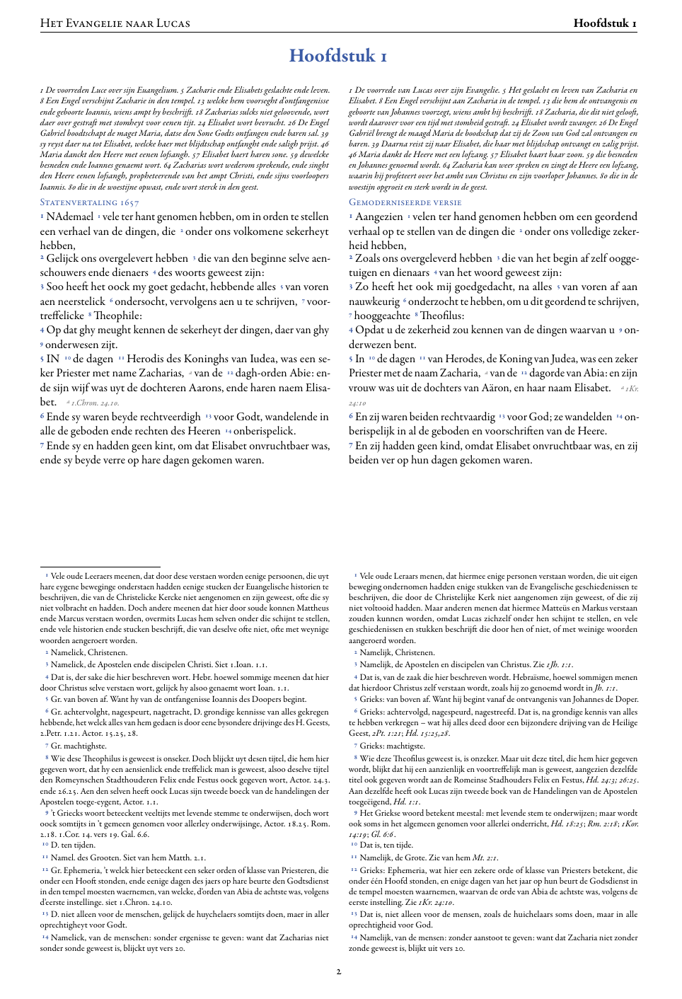

# SVmodernisatie2026

**Nieuwe vergelijkingsviewer:** [compare_all2.html](https://wmotte.github.io/SVmodernisatie2026/compare_all2.html) toont SV1657, GBS met kanttekeningen, HSV, Initiatief SV2027 en onze modernisatie naast elkaar, inclusief aparte diff-kleuren voor hoofdtekst en GBS↔modernisatie-kanttekeningen.

> 📄 **[Achtergrondinformatie (PDF)](achtergrondartikel/Achtergrondinformatie.pdf)** — leesstuk over de
> achtergrond, methode en uitgangspunten van dit project. Begin hier.

<p align="center">
  
</p>

Voorbeeld-PDF's van de parallelbijbel:

- [Lucas](parallelbijbel/LUK_voorbeeld.pdf)
- [Markus](parallelbijbel/MRK_voorbeeld.pdf)
- [Romeinen](parallelbijbel/ROM_voorbeeld.pdf)
- [1 Korinthiërs](parallelbijbel/1CO_voorbeeld.pdf)
- [2 Korinthiërs](parallelbijbel/2CO_voorbeeld.pdf)
- [Galaten](parallelbijbel/GAL_voorbeeld.pdf)
- [Efeziërs](parallelbijbel/EPH_voorbeeld.pdf)
- [Filippenzen](parallelbijbel/PHP_voorbeeld.pdf)
- [Kolossenzen](parallelbijbel/COL_voorbeeld.pdf)
- [1 Tessalonicenzen](parallelbijbel/1TH_voorbeeld.pdf)
- [2 Tessalonicenzen](parallelbijbel/2TH_voorbeeld.pdf)
- [1 Timoteüs](parallelbijbel/1TI_voorbeeld.pdf)
- [2 Timoteüs](parallelbijbel/2TI_voorbeeld.pdf)
- [Titus](parallelbijbel/TIT_voorbeeld.pdf)
- [Filemon](parallelbijbel/PHM_voorbeeld.pdf)
- [Hebreeën](parallelbijbel/HEB_voorbeeld.pdf)
- [Jakobus](parallelbijbel/JAS_voorbeeld.pdf)
- [1 Petrus](parallelbijbel/1PE_voorbeeld.pdf)
- [2 Petrus](parallelbijbel/2PE_voorbeeld.pdf)
- [1 Johannes](parallelbijbel/1JN_voorbeeld.pdf)
- [2 Johannes](parallelbijbel/2JN_voorbeeld.pdf)
- [3 Johannes](parallelbijbel/3JN_voorbeeld.pdf)
- [Judas](parallelbijbel/JUD_voorbeeld.pdf)

---

**Modernisering van de Statenvertaling 1657 (2e druk) — met maximaal
behoud van de SV-eigenheid (100% gedaan door taalmodellen).**

> **Lees eerst [`MODERNISATIE.md`](MODERNISATIE.md).** Daar staat
> expliciet *wat* modernisatie in dit project is, *wat het niet is*,
> volgens welke methode het gebeurt, en welke aannames daaraan
> ten grondslag liggen. Bij twijfel over reikwijdte of vertaalkeuze is dat
> document leidend — wat er in deze README onder "Wat het project doet"
> staat is een samenvatting daarvan.

---

## Inhoudsopgave

- [Cumulatieve kennisopbouw — wat dit project anders doet](#cumulatieve-kennisopbouw--wat-dit-project-anders-doet)
- [Wat het project doet](#wat-het-project-doet)
- [Snel aan de slag](#snel-aan-de-slag)
- [Architectuur](#architectuur)
  - [Werking per vers](#werking-per-vers)
  - [Batch-orchestrator (orchestrator → subagent)](#batch-orchestrator-orchestrator--subagent)
- [Portabiliteit — andere modellen of uitvoeromgevingen](#portabiliteit--andere-modellen-of-uitvoeromgevingen)
- [Projectstructuur](#projectstructuur)
  - [Detail-documentatie](#detail-documentatie)
- [Uitvoerformaat](#uitvoerformaat)
- [Validatie en kwaliteit](#validatie-en-kwaliteit)
  - [Unified Quality Dashboard (`lint_all.py`)](#unified-quality-dashboard-lint_allpy)
  - [Procesgeheugen](#procesgeheugen)
  - [Diepere beoordeling (in-context)](#diepere-beoordeling-in-context)
  - [Adversariële beoordeling per hoofdstuk](#adversariële-beoordeling-per-hoofdstuk)
  - [Meta-adversariële review per boek](#meta-adversariële-review-per-boek)
- [Bijbelverwijzingen](#bijbelverwijzingen)
- [Git-workflow](#git-workflow)
  - [Parallelle agent-sessies — worktrees + clash](#parallelle-agent-sessies--worktrees--clash)
  - [Lokale agent-configuratie — `.agents/settings.local.json`](#lokale-agent-configuratie--agentssettingslocaljson)
- [Voor beoordelaars — veelgestelde vragen over vertaalkeuzes](#voor-beoordelaars--veelgestelde-vragen-over-vertaalkeuzes)
- [Stopregels](#stopregels)
- [Status](#status)
- [Viewer](#viewer)
- [Licentie](#licentie)

---

## Cumulatieve kennisopbouw — wat dit project anders doet

Dit project moderniseert de Statenvertaling 1657 met behoud van theologische consistentie (concordantie) over het hele boek heen. In plaats van verzen geïsoleerd te moderniseren, gebruikt het een gesloten feedback-loop:

1. **Zelfgroeiend geheugen**: Voltooide moderniseringen worden opgeslagen in `memory/verses.db`. Bij elk nieuw vers worden de meest gelijkaardige eerdere vertalingen automatisch als few-shot voorbeelden geladen.
2. **Bi-directioneel zoeken**: Zoekacties in het geheugen vinden plaats op zowel het SV-origineel als op de moderne vertaling om eerdere woordkeuzes snel te spiegelen.
3. **Schone context per batch**: De modernisatie-subagent start voor elke batch van 3 verzen met een schone AI-sessie om drift en hallucinaties in de context te voorkomen.
4. **Terugkoppelingslus**: Regels en stoplists groeien mee tijdens het werk. Zodra we een archaïsme aan de blacklist toevoegen, flaggen de linters dit met terugwerkende kracht over de hele uitvoer-JSON.
5. **Procesgeheugen naast vers-memory**: `output/META/decisions.jsonl` en `memory/process.db` maken bestaande review-besluiten, notes, fixes en rebuttals doorzoekbaar. Ze zijn adviserend: elke nieuwe keuze moet nog steeds tegen SV1657, Grieks en de projectregels worden gecontroleerd.
6. **Recursieve scaffolding-verbeteringen**:
   - **Dynamische stoplijsten**: De carry-over linter (`lint_carryovers.py`) laadt geverifieerde `modernisatie`-tokens dynamisch uit `memory/verses.db` en voegt deze samen met de statische stoplijst.
   - **Automatische rebuttal-propagatie en decision-search**: Eerdere, geverifieerde weerleggingen en beslissingen kunnen opnieuw worden opgezocht of door de scanner worden geërfd, met contextuele safeguards. Dit voorkomt dat dezelfde uitzonderingen in elk hoofdstuk opnieuw vanaf nul moeten worden onderbouwd.

---

## Wat het project doet

Het doel is **renovatie**, geen hervertelling: de archaïsche schil
wordt weggepoetst, alle inhoudelijke kenmerken van de Statenvertaling
blijven intact. Concreet betekent dat:

- **Formele equivalentie** — de Textus Receptus (NT) blijft leidend
  voor zinsbouw en woordkeus. Geen vrije parafrase.
- **Concordantie** — hetzelfde Griekse woord krijgt zoveel mogelijk
  hetzelfde Nederlandse woord, ook over verzen heen. Een lokale
  vectordatabase met embeddings van een externe service (nu Gemini,
  verwisselbaar) haalt eerdere keuzes op als voorbeeldparen.
- **Kanttekeningen blijven** — alle `<…>`-blokken (uitleg,
  alternatieven, kruisverwijzingen) worden behouden en eveneens
  gemoderniseerd.
- **Vierkante haken `[…]` blijven** — markeren toevoegingen door de
  SV-vertalers; behouden in zelfde aantal en positie.
- **Hoofdletterdiscipline** — SV-hoofdletters (eerbied en andere) blijven
  staan zoals in het origineel; nooit toevoegen, nooit verwijderen.
- **Geen exegese in de hoofdtekst** — interpretatie blijft binnen
  de kanttekeningen.

Volledige principes: [`MODERNISATIE.md`](MODERNISATIE.md) (definitie,
methode, aannames — leidend bij twijfel) en [`AGENTS.md`](AGENTS.md)
(orchestratie en conventies).

---

## Snel aan de slag

```bash
cd SVmodernisatie2026         # of waar je de repository hebt staan
uv sync
cp .env.example .env          # vul GOOGLE_API_KEY in (Google AI Studio)
```

Agent-CLI's die `AGENTS.md` en `.agents/` direct lezen kunnen meteen
door. **Voor Claude Code-gebruikers**: de echte bestanden heten
`AGENTS.md` en `.agents/` — niet meer gecommit als `CLAUDE.md` /
`.claude/`. Claude Code leest alleen de laatste twee, dus maak
eenmalig lokaal symlinks aan (staat in `.gitignore`, dus blijft
persoonlijk):

```bash
ln -s AGENTS.md CLAUDE.md
ln -s .agents   .claude
```

> **Let op — als `.claude/` lokaal al bestaat als echte directory**
> (bijv. omdat Claude Code daar `settings.local.json` of `worktrees/`
> heeft aangemaakt), faalt `ln -s .agents .claude`. Symlink dan
> alleen de skills-submap, zodat `sv-batch-orchestrate` en de andere
> skills vindbaar zijn:
>
> ```bash
> ln -s ../.agents/skills .claude/skills
> ```
>
> Zonder deze symlink krijg je bij `moderniseer …` de melding
> `Error: Unknown skill: sv-batch-orchestrate`. Een nieuwe sessie
> (`/clear` of opnieuw starten) is nodig nadat de symlink is gelegd,
> omdat Claude Code de skill-lijst bij sessiestart inlaadt.

Daarna kun je in de agent-CLI, vanuit de hoofdmap van de repository, aanroepen doen in
natuurlijke taal:

```
moderniseer LUK 1:1-3
moderniseer Lucas 1 vers 1 t/m 3
moderniseer 2CO hoofdstuk 6
moderniseer de volgende drie verzen van 2CO 6
moderniseer LUK 1 introductie
moderniseer LUK 24 epiloog
```

De boekcode is altijd 3-letterig (`LUK`, `MAT`, `MRK`, `JHN`, `ACT`,
`ROM`, `HEB`, ...) en moet overeenkomen met de bestandsnamen in
`input.sv/`.

---

## Architectuur

Twee aanroep-modi, beide met het agent-model als enige model dat
moderniseert:

- **Directe vers-range** (`moderniseer LUK 1:1-3`) — `sv-modernize`
  draait inline in de huidige conversatie. Eén agent, één set verzen,
  klaar.
- **Batch-orchestrator** (`moderniseer 2CO hoofdstuk 6`, `moderniseer de
  volgende drie verzen van 2CO 6`) — `sv-batch-orchestrate` neemt het over.
  Detecteert het volgende blok van 3 onbehandelde verzen, **start een
  verse modernisatie-subagent met schone context** die `sv-modernize`
  uitvoert, doet daarna kritische beoordeling en scherpt de regelbestanden aan,
  en verzorgt commit, push, PR en merge per batch naar `main`. Loopt autonoom door
  totdat het hoofdstuk klaar is. Schone context per batch voorkomt
  drift en houdt geheugengebruik beperkt.

De orchestrator-instructies staan in [`AGENTS.md`](AGENTS.md). De
skills onder `.agents/skills/` doen de gespecialiseerde taken:

| Skill                   | Wanneer aanroepen                                                     |
|-------------------------|-----------------------------------------------------------------------|
| `sv-modernize`          | Bij elke directe modernisatie-opdracht.                               |
| `sv-batch-orchestrate`  | Bij "volgende drie" / "hoofdstuk X" — orchestreert subagent per batch.|
| `sv-memory`             | Vóór elk vers (voorbeeldparen ophalen), ná elk vers (toevoegen aan database), en vóór elke batch (DB ↔ uitvoer synchroniseren). |
| `sv-bibref`             | Voor elke `$...$`-verwijzing in de moderne tekst.                     |
| `sv-validate`           | Ná het schrijven van de uitvoer-JSON. Bij fout: corrigeer en herhaal. |
| `sv-semantic-review`    | In de batch-flow ná validator en linters — false friends, idioom, concordantie en HSV-spiegel (taalfouten en drempel-archaïsmen). Werkt ook zelfstandig. |
| `sv-adversarial-review` | Strenge bevindingenlijst per hoofdstuk. Automatisch na `CHAPTER_COMPLETE` in de orchestrator-flow, of expliciet ("review hoofdstuk 8" / "adversarial review LUK 8"). Uitgangspunt = overtreding; weerleggingen moeten een regel- of Grieks-referentie hebben. |
| `sv-meta-review`        | Meta-adversariële review over alle HSV-diffs van een afgesloten boek of range. Aggregeert cross-chapter patronen, classificeert in A/B/C (HSV-noise / per-vers fix / scaffolding-gap), en kan in apply-modus regel-deltas + per-hoofdstuk content-fixes uitrollen. Trigger: "meta-review LUK", "meta-review LUK apply". |

### Werking per vers

```
input.sv/LUK/LUK.1.json
        │
        ▼
┌─────────────────────────────────────────────────────────┐
│ 1. sv-memory query   — top-k vergelijkbare paren        │
│ 2. modernisatie       — volgens AGENTS.md principes     │
│ 3. sv-bibref          — $Iudic. 13.4.$ → $Ri. 13:4$     │
│ 4. schrijf JSON       — incrementele upsert per vers    │
│ 5. sv-validate        — harde controles; bij fout terug │
│ 6. sv-memory add      — vector-embedding in SQLite      │
└─────────────────────────────────────────────────────────┘
        │
        ▼
output/LUK/LUK.1.json
memory/verses.db
```

Vers `N+1` profiteert van vers `N` als voorbeeldpaar — daarom
loopt de skill **één vers per cyclus**, niet de hele range tegelijk.

### Batch-orchestrator (orchestrator → subagent)

Bij `moderniseer hoofdstuk X` of `moderniseer de volgende drie verzen`
loopt de pipeline anders:

```
hoofdagent (orchestrator)                              subagent
─────────────────────────                              ──────────────
0.5 sync memory.py ↔ output/  (verouderde items opnieuw embedden)  ·
0.6 procesgeheugen verversen (decisions + FTS-index)               ·
1. detect next 3 verzen                                            ·
2. start modernisatie-subagent ─ prompt: "doe X" ────►             ·
   (schone context)                                                · ┌─────────────┐
                                                                   · │ sv-modernize│
                                                                   · │ per vers:   │
                                                                   · │   memory    │
                                                                   · │   schrijf   │
                                                                   · │   bibref    │
                                                                   · │   validate  │
                                                                   · │   memory add│
                                                                   · └─────────────┘
3. beoordeel subagentrapport ◄────────── 2-4 regels rapport ◄───── ·
   - validatoruitvoer
   - lint_carryovers (borderline-archaïsmen)
   - lint_archaismen (retro tegen blacklist)
   - lint_false_friends (verschoven betekenis)
   - sv-semantic-review (in-context: idioom + concordantie + HSV-spiegel)
   - decision-memory raadplegen bij terugkerende twijfel
4. regelbestandwijzigingen (ARCHAISMEN.md, blacklist, STOPLIST)
5. commit + push + PR + merge per batch
6. terug naar 0.5, tot hoofdstuk klaar
6.5 (alleen bij CHAPTER_COMPLETE) sv-adversarial-review:
     - scan + in-context aanvulling → review.<H>.json
     - per open issue: fix óf substantieve rebuttal
     - commit fixes als adversarial-fix branch
     - verificatieronde; bij heropening: max. 1 extra ronde
7. eindrapport
```

**Geheugen-DB-synchronisatie** (Stap 0.5): de orchestrator vergelijkt vóór elke
batch de uitvoer-JSON's met de embedding-paren in `memory/verses.db`.
Verschilt `original`, `modernized` of `source_text` (bv. door
handmatige correcties, kanttekeningrondes of semantic-review-wijzigingen
buiten de standaard add-flow), dan wordt dat vers opnieuw geëmbed.
Voorkomt dat voorbeeldparen naar verouderde modernisaties
verwijzen — wat het hele concordantie-doel teniet zou doen. Detectie
is goedkoop (alleen tekstvergelijking, geen API-aanroepen); opnieuw embedden via
Gemini gebeurt alleen voor de daadwerkelijk gedrifte verzen.

**Procesgeheugen** (Stap 0.6): bestaande review-issues, rebuttals,
verse-notes en decisions worden lokaal doorzoekbaar gemaakt via
`output/META/decisions.jsonl` en `memory/process.db`. Dit verandert geen
modernisatie-output en is niet normatief; het levert alleen context voor
terugkerende twijfelgevallen.

De **subagent doet al het modernisatiewerk** (stap 2) — krijgt een
vers-range, leest `AGENTS.md` en `sv-modernize` SKILL, schrijft de
uitvoer, valideert, voegt toe aan het geheugen, en stopt met een kort
rapport. Geen git-acties.

De **orchestrator (hoofdagent) doet de beoordeling en git-afhandeling** (stappen
3-5) — leest het rapport, draait extra linters, past evt. `STOPLIST` /
`ARCHAISM_BLACKLIST` aan, corrigeert het vers eventueel zelf, en
zorgt dat elke batch een eigen commit + PR krijgt vóór de volgende
begint.

---

## Portabiliteit — andere modellen of uitvoeromgevingen

De modernisatie-pipeline is gelaagd en grotendeels model- en aanbiederonafhankelijk:

- **Aanbiederonafhankelijk**: Alle Python-scripts (`validate.py`, `lint_*.py`, `memory.py`, etc.), de JSON-invoer/uitvoer-schemas en de regelbestanden (`ARCHAISMEN.md`, `rules_data.py`) zijn volledig deterministisch en vereisen geen LLM-aanroepen.
- **Model- en cache-eisen**: De promptcache op skill-instructies en voorbeeldcontext maakt de orchestrator-flow kostenefficiënt. Modellen met grote context (≥200k) hebben de voorkeur voor reviews.
- **Uitvoeromgeving-specifiek**: De skills (`.agents/skills/*/SKILL.md`) en subagent-spawning zijn geoptimaliseerd voor een agent-CLI met skills en subagents. Om over te stappen naar een andere SDK of LLM, moet je vooral de skill-prompts adapteren en de subagent-orkestratie buiten de CLI opnieuw implementeren.

---

## Projectstructuur

| Pad                              | Wat                                                              |
|----------------------------------|------------------------------------------------------------------|
| [`AGENTS.md`](AGENTS.md)         | Orchestrator-instructies (vertaalprincipes, conventies, schema) |
| `.agents/skills/sv-modernize/`        | Hoofdskill: protocol per directe aanroep                   |
| `.agents/skills/sv-batch-orchestrate/`| Orchestrator: start subagent per batch, doet beoordeling + git |
| `.agents/skills/sv-memory/`           | Wrapper rond `scripts/memory.py`                           |
| `.agents/skills/sv-bibref/`           | Wrapper rond `scripts/bibref.py`                           |
| `.agents/skills/sv-validate/`         | Wrapper rond `scripts/validate.py`                         |
| `.agents/skills/sv-semantic-review/`  | In-context semantische review (false friends, idioom, concordantie) |
| `.agents/skills/sv-adversarial-review/` | Adversariële bevindingenlijst per hoofdstuk met scan + verificatieronde |
| `.agents/skills/sv-meta-review/`      | Meta-adversariële review over een afgesloten boek of range — cross-chapter patroon-aggregator |
| `scripts/memory.py`                   | Vectordatabase met embeddings van een externe service (SQLite, 768 dim) |
| `scripts/index_process_memory.py`     | FTS5-index over review-issues, rebuttals en output-notes (`memory/process.db`) |
| `scripts/extract_decisions.py`        | Extraheert review-beslissingen en notes naar `output/META/decisions.jsonl` |
| `scripts/query_decisions.py`          | Zoekt in decision-memory zonder API-aanroep |
| `scripts/rule_curator.py`             | Dry-run curator voor stoplist-/blacklist-/rebuttal-drift |
| `scripts/bibref.py`                   | Bijbelref-normalisatie via CSV-lookup                      |
| `scripts/validate.py`                 | Modernisatiecontrole (kanttekeningen, haken, hoofdletters, refs)  |
| `scripts/lint_carryovers.py`          | Borderline-archaïsmen die de blacklist mist                |
| `scripts/lint_archaismen.py`          | Terugwerkende controle op `ARCHAISM_BLACKLIST` over alle uitvoer       |
| `scripts/lint_false_friends.py`       | Woorden met verschoven betekenis t.o.v. SV / Grieks        |
| `scripts/check_refdata.py`            | Controle op de CSV-tabellen in `refdata/`              |
| `scripts/adversarial_scan.py`         | Strenge scanner per hoofdstuk; schrijft `output/<BOEK>/review.<H>.json` met scan/verificatie |
| `scripts/meta_diff_aggregate.py`      | Deterministische aggregator over `docs/diff_hsv_<BOEK>_*.json` — schrijft `output/META/candidates_<BOEK>.json` (carryover, fossiel-lidwoord, latinaat-window, cap-asym) |
| `refdata/afkortingen.csv`        | SV-afkortingen → moderne notatie                                |
| `refdata/bible_book_references.csv` | Modern boeknaam → afkorting (`Genesis,Gn.` etc.)             |
| `input.sv/<BOEK>/`               | Invoer per boek/hoofdstuk (SV1657 + Textus Receptus)            |
| `output/<BOEK>/`                 | Gemoderniseerde verzen — incrementeel, groeit per aanroep       |
| `memory/verses.db`               | Lokale vectordatabase (gitignored)                              |
| `memory/process.db`              | Lokale FTS5-procesindex (gitignored)                            |

### Detail-documentatie

Alles wat de skills nodig hebben staat in losse markdown-bestanden,
zodat ze geen contextruimte afsnoepen van `AGENTS.md`:

- [`MODERNISATIE.md`](MODERNISATIE.md) — wat modernisatie is, wat niet, methode, aannames (leidend)
- [`ARCHAISMEN.md`](ARCHAISMEN.md) — substituties + eigennamen NBV21
- [`KANTTEKENINGEN.md`](KANTTEKENINGEN.md) — `<…>`-conventies + redundantie-regel
- [`BIJBELVERWIJZINGEN.md`](BIJBELVERWIJZINGEN.md) — `$…$`-formaat + voorbeelden
- [`INTRO_EPILOOG.md`](INTRO_EPILOOG.md) — regels voor introductie en epiloog
- [`OUTPUT_SCHEMA.md`](OUTPUT_SCHEMA.md) — volledig JSON-schema + incrementeel-gedrag
- [`GIT_WORKFLOW.md`](GIT_WORKFLOW.md) — branches, commits, PR's, merges

---

## Uitvoerformaat

Per hoofdstuk één bestand: `output/<BOEK>/<BOEK>.<H>.json`. Velden op hoofdniveau:
`book`, `chapter`, `introduction`, `verses`, `epilogue`
(laatste alleen bij boek-eind).

```jsonc
{
  "book": "LUK",
  "chapter": 1,
  "introduction": {
    "original":     "...",
    "modernized":   "...",
    "generated_at": "2026-05-08T12:34:56Z",
    "model":        "<agent-model-id>"
  },
  "verses": [
    {
      "verse_number": 1,
      "original":     "<originele tekst incl. <kanttekeningen> en $bijbelrefs$>",
      "modernized":   "<moderne tekst incl. moderne <kanttekeningen> en $bijbelrefs$>",
      "source_text":  "<Textus Receptus, byte-exact uit invoer>",
      "generated_at": "2026-05-08T12:34:56Z",
      "model":        "<agent-model-id>",
      "memory_examples_used": 3,
      "notes":        [/* optioneel — twijfels, afwijkingen, context */]
    }
  ]
}
```

---

## Validatie en kwaliteit

Elke modernisatie passeert strikte validatie- en lintcontroles voordat deze naar de database mag:

**Harde fouten (validatiefout, max. 3× corrigeren)**:
- Aantal `<…>`-kanttekeningen < origineel.
- Aantal `[…]`-vertalerstoevoegingen ≠ origineel.
- Archaïsmen uit de blacklist (gecentraliseerd in `rules_data.py`).
- Ongeldig bijbelverwijzingsformaat (`$Boek H:V$`) of losse refs in kanttekeningen.
- Gewijzigde `source_text` (NFC-vergelijking).
- Schending van de hoofdletterdiscipline (typografische initiële drop-caps daargelaten).
- Archaïsche afkortingen in kanttekeningen (bijv. `<D. ` of `<Gr. ` moeten worden genormaliseerd naar `<dat is, ` of `<Grieks: `).

**Waarschuwingen**:
- Hoofdletter-woord helemaal afwezig (door herformulering).
- `source_text` byte-anders maar NFC-equivalent.

### Unified Quality Dashboard (`lint_all.py`)

In plaats van de afzonderlijke linterscripts handmatig te draaien, is er een unified linter die ze allemaal in één keer uitvoert en een overzichtelijk dashboard toont:

```bash
python3 scripts/lint_all.py --output output/LUK/LUK.1.json [--terse]
python3 scripts/lint_all.py --root output/ [--terse]
```

Het script voert de volgende linters uit en geeft een non-zero exit code bij harde fouten (ideaal voor pre-commit hooks):
1. **`lint_archaismen.py`** (hard): Scant de uitvoer recursief tegen de `ARCHAISM_BLACKLIST` in `rules_data.py`.
2. **`lint_false_friends.py`** (waarschuwing): Spoort woorden op met verschoven betekenis t.o.v. SV/Grieks (bijv. `menen`, `dagorde`).
3. **`lint_carryovers.py`** (suggesties): Geeft een gerangschikte lijst van onveranderde tokens (≥4 tekens) die niet op de legitieme (statische + dynamische uit `verses.db` geladen) `STOPLIST` staan.

In de batch-flow van de orchestrator (`sv-batch-orchestrate`) draait `lint_all.py` na elke nieuwe batch van 3 verzen. Harde fouten blokkeren de commit; waarschuwingen en suggesties zijn input voor de kritische semantische beoordelingsstap.

Voor consistentie van de geheugen-DB (draai handmatig na een correctiesessie als
je geen orchestrator-batch start; de orchestrator zelf doet dit
automatisch in Stap 0.5):

```bash
uv run python scripts/memory.py sync --root output/             # re-embed dirty/missing
uv run python scripts/memory.py sync --root output/ --check-only # alleen detecteren
```

### Procesgeheugen

Naast de canonieke vers-memory (`memory/verses.db`) is er een
procesgeheugen voor review-issues, rebuttals en verse-notes. Deze laag
verandert geen modernisatie-output; hij schrijft alleen lokale
zoekbestanden onder `memory/` of `output/META/`. De batch-flow kan deze
informatie gebruiken als extra context, maar de bewijslast blijft altijd
bij SV1657, Grieks en de projectregels.

Normaal hoef je deze scripts niet handmatig te draaien om door te
moderniseren. Ze zijn nuttig na grote correctierondes, bij losse
reviews, of wanneer je expliciet historische beslissingen wilt opzoeken.

```bash
uv run python scripts/index_process_memory.py --root output --rebuild
uv run python scripts/index_process_memory.py --query "concordantie drift" --book LUK

uv run python scripts/extract_decisions.py --root output
uv run python scripts/query_decisions.py "aan land gegaan" --book LUK

uv run python scripts/rule_curator.py --book LUK --dry-run
```

`memory.py query` sorteert voorbeeldparen op `similarity * trust` en
rapporteert zowel de ruwe similarity als de gewogen score. Trust is
uitsluitend retrieval-metadata; validatie en canonieke output veranderen
er niet door.

```bash
uv run python scripts/memory.py mark --book LUK --chapter 8 --verse 15 --review-flag corrected --reason LUK-8-15-001
uv run python scripts/memory.py trust --book LUK --chapter 8 --verse 15 --set 0.6 --reason "review-correctie"
```

### Diepere beoordeling (in-context)

De `sv-semantic-review` skill (`.agents/skills/sv-semantic-review/`)
laat de orchestrator (het agent-model zelf) de semantische beoordeling doen
op basis van de Griekse brontekst, het SV1657-origineel en de
modernisatie. Geen externe LLM-aanroep.

Vier soorten observaties + één arbitrage-stap:

1. **False friends** — woorden waarvan de moderne lezer iets anders
   leest dan SV/Grieks bedoelden, ook als het deterministische lint
   ze mist (context-afhankelijke verschuiving).
2. **Idiomatic mismatches** — letterlijke vertalingen die in modern
   NL onnatuurlijk klinken (bv. *"vrees viel op hem"* i.p.v.
   *"vrees overviel hem"*).
3. **Concordantie-twijfel** — woordkeuze die afwijkt van wat de SV
   elders voor hetzelfde Grieks gebruikt; onderbouwd met top-3
   matches uit `sv-memory`.
4. **HSV-spiegel** — vergelijking met de Herziene Statenvertaling
   via `docs/diff_hsv_<BOEK>_<H>.json` (gegenereerd door
   `scripts/compare_hsv.py`). HSV is *niet normatief* en bovendien
   **vrijer** dan onze modernisatie — exegese in de hoofdtekst,
   eigen kanttekeningen `<HSV: …>`, soms eerbiedshoofdletters,
   structurele herbouw van zinnen. Die keuzes nemen we bewust niet
   over (hoofdletters, kanttekeningomvang, parafrase, exegese in de hoofdtekst,
   structurele herbouw, lexicaal register, vierkante haken). Maar
   de spiegel onthult soms (a) echte taalfouten of semantische
   missers in onze modernisatie, of (b) drempel-archaïsmen die wij
   conservatief lieten staan terwijl HSV ze modern oplost zonder
   zinsbouw of inhoud aan te tasten (zie
   [`MODERNISATIE.md`](MODERNISATIE.md) §2.7). HSV-bewijs alléén
   is nooit genoeg voor een wijziging — een 4a/4b-bevinding moet altijd
   onafhankelijk verifieerbaar zijn tegen SV1657 + Grieks.
   Terugkerende patronen lekken via dezelfde regelbestandmechanismen
   (`ARCHAISMEN.md`, `lint_false_friends.py`, `validate.py`-blacklist)
   terug naar het hele proces. Voor Lucas bestaat daarnaast een
   post-hoc vergelijking met SV2027 / "Initiatief 2027" in
   `docs/diff_LUK_*.json` en `docs/diff_all_LUK_*.json` — dat is een
   archief, niet meer onderdeel van de batch-pipeline (SV2027 is
   buiten Lucas nog niet gepubliceerd).

**Flagarbitrage** (Stap 3.7): de in-context beoordelaar kan twee
regex-kwetsbare validatorcategorieën overrulen — hoofdletter-
discipline en §2.3-participium — wanneer parafrase-herstructurering
de regex misleidt zonder dat de regel daadwerkelijk geschonden wordt
(bv. een direct-rede-formule, of attributief gebruik in plaats van
adverbiaal). Strikt: override kan alleen flags negeren (nooit nieuwe
issues toevoegen), uitgangspunt = `confirmed`, ≥80% zekerheid voor
overrulen, en de motivatie wordt expliciet gerapporteerd in een
arbitrageblok dat de orchestrator honoreert vóór hij lussen voor nieuwe
pogingen triggert. Andere validatorflags (kanttekeningaantal, vierkante
haken, bijbelverwijzingsformaat, archaïsme-blacklist, source_text) zijn
expliciet **niet** geschikt voor arbitrage.

De skill volgt een streng anti-hallucinatieprotocol: elke bevinding moet
gekoppeld zijn aan een exacte substring uit de modernisatie, en
suggesties die al in de SV-tekst zelf staan worden weggelaten.

**Concordantie-context** komt uit één goedkope embedding-query per vers:

```bash
uv run python scripts/memory.py query --text "<SV-vers>" \
    --k 3 --axis sv \
    --exclude-book LUK --exclude-chapter 1 --exclude-verse 12
```

Bij lege geheugen-DB doet de skill alleen controles op false friends en idioom;
concordantiebevindingen worden dan strikt overgeslagen.

**Onderdeel van de batch-flow**: de orchestrator activeert de skill op
elke nieuwe batch (3 verzen) ná validator + linters, past wijzigingen direct
toe via de Edit-tool, en draait validator + `lint_false_friends` opnieuw na elke
correctie. Voor een losse aanroep buiten de batch-flow — bijvoorbeeld om
een bestaand hoofdstuk retro-actief door te lichten — werkt de skill
ook zelfstandig ("review LUK 1:11-13").

### Adversariële beoordeling per hoofdstuk

De `sv-adversarial-review` skill (`.agents/skills/sv-adversarial-review/`)
is een **strenge laatste poort** voor een afgerond hoofdstuk. Deze draait
automatisch in de orchestrator-flow bij `CHAPTER_COMPLETE` (Stap 6.5),
en is ook expliciet aan te roepen — "review hoofdstuk 8", "adversarial
review LUK 8".

**Waarom apart van semantic-review?** Semantic-review werkt per batch
van 3 verzen en richt zich op de inhoudelijke vertaalkeuze. Adversarial-
review werkt per hoofdstuk en zoekt naar **patroon-schendingen**:
inconsistente concordantie over het hele hoofdstuk, kanttekening-
luiheid die in afzonderlijke batches gemist is, finiete participia die
door de validator zijn geslipt, drempel-archaïsmen die nu pas binnen
hoofdstuk-context detecteerbaar zijn. Die tweede blik is bewust
adversarieel: **uitgangspunt = overtreding**.

**Bevindingenlijst**: alle bevindingen komen in `output/<BOEK>/review.<H>.json`
met een vaste status-cyclus:

```
open → (fix óf rebuttal) → fixed | rebutted → verified | reopened
```

- **fix**: vers wijzigen via Edit-tool, `fix_commit` invullen na commit.
- **weerlegging**: substantief argument (≥60 tekens, regel- of Griekse-
  term-referentie, vers-specifiek, niet identiek toepasbaar op andere
  issues). Generieke "behoud van SV-stijl" wordt door de verifier
  heropend.
- **verificatie** meet weerleggingen en controleert patronen opnieuw. Heropende issues
  krijgen één extra fix-/weerleggingsronde, daarna belanden eventuele
  resterende issues in het hoofdstuk-eindrapport.

**Twee modi van de scanner:**

```bash
uv run python scripts/adversarial_scan.py scan   --book LUK --chapter 8
uv run python scripts/adversarial_scan.py verify --book LUK --chapter 8
```

`scan` is de eerste ronde (regex-gebaseerde detectie + in-context
aanvulling door de skill). `verify` is de tweede ronde die fixes
opnieuw controleert en luie weerleggingen heropent. Exit-code ≠ 0 = nog
`open`/`reopened` issues; de orchestrator kan pas een eindrapport geven bij
exit 0 of na 2 fix-rondes.

**Categorieën die de scanner dekt:**

| Categorie | Ernst |
|---|---|
| §2.3 finiet participium (`-ende`, `-end,`) | hard / soft |
| §2.3b passief van zien | hard |
| §2.3b vocatief-u, bijwoord-coda, infinitief-met-object | soft |
| §2.7 drempel-archaïsmen (productiviteits-/verwarringtest) | soft |
| concordantie-drift cross-vers | soft |
| kanttekening-luiheid (-ende, SV-archaïsme, afkorting niet uitgeschreven) | hard |
| kanttekening-redundantie (4-token sliding window) | soft |
| validator-leak (re-match op huidige `ARCHAISM_BLACKLIST`) | hard |

**In-context aanvulling** is een verplicht onderdeel: de regex-scanner
mist context-gevoelige overtredingen (idiomatische Latinaat-resten,
verwijzings-kanttekeningen onterecht als redundant, false-friend-
correcties die juist concordantie-drift veroorzaken). De skill loopt
het hoofdstuk vers-voor-vers door en voegt eigen vondsten toe als
nieuwe issues, en weegt elk prescan-issue kritisch — een weerlegging
voor false positives moet net zo substantief zijn als voor echte
overtredingen.

**Plek in de orchestrator-flow:** uitsluitend na `CHAPTER_COMPLETE`
(Stap 1 in de hoofdlus rapporteert dat). De fix-commits gaan in een
aparte `feature/<boek>-<h>-adversarial-fix`-branch met eigen PR + merge
— niet in de laatste batch-PR mengen, zodat de adversariële ronde apart
controleerbaar is. De skill mag **niet** worden overgeslagen; "geen
issues gevonden" (ronde 1 exit 0) is een geldige uitkomst, maar de
skill-aanroep zelf moet in het transcript staan.

**Zelfstandig** (los van een batch-flow):

```
review hoofdstuk 8
adversarial review LUK 8
review LUK 8 streng
```

Werkt op elk hoofdstuk waar `output/<BOEK>/<BOEK>.<H>.json` bestaat.
Bij heraanroep wordt een bestaande bevindingenlijst (`review.<H>.json`)
geërfd: status-/`fix_commit`-/`rebuttal`-waarden blijven staan voor
identieke issues. 

**Automatische Weerleggings-Propagatie (Rebuttal Propagation)**:
Als een issue in het huidige hoofdstuk nog geen status heeft, maar er is in een ander (reeds verwerkt) hoofdstuk al een weerlegging voor deze categorie en specifieke term geschreven én geverifieerd (status `"rebutted"` of `"verified"`), dan wordt deze weerlegging automatisch gekopieerd (geprefixed met `[Automated Propagation]`) en de status op `"rebutted"` gezet. Een heuristisch filter controleert hierbij of de term ook daadwerkelijk voorkomt in de rebuttal-tekst om foutieve cross-matching te voorkomen.

Voor een volledig nieuwe start (zonder erfenis uit het huidige hoofdstuk, maar nog wel met historische propagatie): vlag `--fresh`.

### Meta-adversariële review per boek

De `sv-meta-review` skill (`.agents/skills/sv-meta-review/`) is een
**meta-laag bovenop de per-hoofdstuk adversarial-review**. Waar
`sv-adversarial-review` één hoofdstuk afzonderlijk fileert, kijkt
`sv-meta-review` over alle afgesloten hoofdstukken van een boek heen
en zoekt naar **cross-chapter patronen** in de HSV-diffs:

- **Carryovers** — woorden die SV1657 letterlijk doorgeeft maar HSV
  consistent modern oplost, in meerdere hoofdstukken.
- **Fossiel-lidwoord** — `des/der/den`-vormen die buiten de erkende
  gefossiliseerde formules (zoon des mensen, koninkrijk der hemelen,
  etc.) doorlopen.
- **Latinaat-window** — Latijns aandoende participia/zinsstructuren
  die over hoofdstukken heen terugkeren.
- **Cap-asym** — hoofdletter-asymmetrie tussen SV1657 en onze
  modernisatie die op patroonniveau pas zichtbaar wordt.

**Aggregatie is deterministisch:** `scripts/meta_diff_aggregate.py`
leest alle `docs/diff_hsv_<BOEK>_*.json`-bestanden, telt frequenties,
groepeert per pattern-kind en schrijft `output/META/candidates_<BOEK>.json`
(boek-specifiek). Geen LLM-aanroep.

```bash
uv run python scripts/meta_diff_aggregate.py \
    --book LUK --chapters 1-18 --min-freq 2
```

**Classificatie in drie buckets** (in-context door het agent-model):

| Bucket | Betekenis | Actie |
|---|---|---|
| **A** | HSV-keuze, parafrase, eerbiedshoofdletter — geen modernisatie-tekortkoming | Log in `scaffolding_deltas_<BOEK>.md`, geen edit |
| **B** | Modernisatie-fix die we gemist hebben (drempel-archaïsme, false friend, fossiel) | Per occurrence opnemen in `output/META/findings_<BOEK>.json` met `review.<H>.json`-issue-schema |
| **C** | Scaffolding-gap — bestaande lint had het pattern moeten vangen (≥3× voorkomen) | Regel-delta uitrollen (uitbreiding `DREMPEL_ARCHAISMEN`, `ARCHAISM_BLACKLIST`, `FALSE_FRIENDS`, `STOPLIST`) |

**Apply-modus** rolt de gevonden fixes daadwerkelijk uit, gesplitst over
twee PR's:

- `meta-review LUK apply rules` → alleen 3b (regelbestand-deltas in
  `scripts/rules_data.py`, `ARCHAISMEN.md` en relevante lint-/scanregels).
  Aparte PR, eerst mergen.
- `meta-review LUK apply content` → 3a (per-hoofdstuk content-fixes
  via Edit-tool, ná merge van de regel-PR zodat retro-actief de juiste
  blacklist geldt).

**Waarom apart van adversarial-review per hoofdstuk?** Een carryover
die in één hoofdstuk 1× voorkomt blijft binnen die hoofdstuk-context
makkelijk een legitieme keuze (eigennaam-cluster, register-keuze).
Pas wanneer hetzelfde pattern in vier hoofdstukken terugkeert wordt
duidelijk dat het een latent drempel-archaïsme of scaffolding-gap is.
De meta-review vangt precies die signaalsterkte die per-hoofdstuk-
review structureel mist.

**Plek in de workflow:** na afsluiting van een boek of een blok
hoofdstukken (typisch 8+). Niet voor enkele verzen — gebruik dan
`sv-semantic-review` of `sv-adversarial-review`. Niet voor introducties
of epilogen (geen HSV-equivalent in de diff-bestanden).

Trigger-zinnen: `meta-review LUK`, `draai meta-adversarial`,
`scan alle HSV-diffs voor patronen`, `meta-review LUK apply`.

---

## Bijbelverwijzingen

Formaat na normalisatie: `$Boek H:V$`, `$Boek H:V,W$`, `$Boek H:V-W$`,
of samengesteld `$Boek H:V; H:W$` (boeknaam alleen bij wisseling). De
conversie is idempotent — heraanroep is veilig.

```
$Iudic. 13.4.$                       → $Ri. 13:4$
$Exod. 30.7. Levit. 16.17.$          → $Ex. 30:7; Lv. 16:17$
$Iesa. 9.1. ende 42.7. ende 43.8.$  → $Js. 9:1; 42:7; 43:8$
```

Verwijzingen binnen kanttekeningen volgen hetzelfde formaat én staan ook
tussen `$…$`. De vlag `--include-kanttekeningen` vangt losse verwijzingen
binnen `<…>`-blokken automatisch. Volledig:
[`BIJBELVERWIJZINGEN.md`](BIJBELVERWIJZINGEN.md).

---

## Git-workflow

Korte versie:

1. Feature branch vanuit `main`: `git checkout -b feature/<naam>`.
2. Stage gericht (geen `git add -A`), commit zonder
   agent-attributietrailers (bv. `Generated with …`, `Co-Authored-By: …`).
3. `git push -u origin feature/<naam>`. **Stop.** Geen PR of merge
   tenzij expliciet gevraagd.
4. PR alleen op expliciete vraag (`gh pr create`). **Stop.**
5. Merge alleen op expliciete vraag.

Volgorde push → PR → merge is dwingend. Volledige regels en verboden
patronen: [`GIT_WORKFLOW.md`](GIT_WORKFLOW.md).

### Parallelle agent-sessies — worktrees + clash

Voor het gelijktijdig draaien van meerdere agent-sessies gebruiken we Git worktrees via `scripts/wt.sh`.
Conflict-detectie is volledig self-contained en draait via [wt_clash.py](file:///Users/wmotte/Desktop/projects/SVmodernisatie2026/scripts/wt_clash.py) (wat de noodzaak voor een externe `clash`-binary vervangt).

**Snel aan de slag:**
```bash
./scripts/wt.sh new luk4              # Maakt worktree + branch + symlinks
cd ../SVmodernisatie2026.wt/luk4      # Ga naar de parallelle directory
# Start de agent-CLI hier...
# Na afloop, vanaf de hoofdrepository:
./scripts/wt.sh rm luk4
```

**Subcommando's:**
- `wt new <suffix> [base]`: Maakt een nieuwe worktree aan en branch `feature/<suffix>`. Symlinkt `memory/` en kopieert `.env` en permission settings.
- `wt list`: Voert `wt_clash.py` uit om een overzicht van actieve worktrees, hun branches en eventuele conflicten te tonen.
- `wt rm <suffix>`: Verwijdert de worktree (branch blijft bestaan conform branchbeleid).
- `wt clash`: Handmatige pass-through naar de python conflict detector.

**Vuistregel voor concurrency**: Eén worktree per hoofdstuk (verschillende hoofdstukken parallel mag, twee batches uit hetzelfde hoofdstuk niet wegens write-race gevaren). De database `memory/verses.db` is gedeeld via symlink; SQLite WAL-modus handelt gelijktijdige leesacties af.

### Lokale agent-configuratie — `.agents/settings.local.json`

Persoonlijke (niet-team) agent-CLI-instellingen voor deze repository komen in
`.agents/settings.local.json`. Dat bestand is **gitignored via global
gitignore** (`~/.config/git/ignore` regel `**/.claude/settings.local.json`)
— het is per definitie per-machine en gaat dus nooit een PR in.

Wat je er typisch in zet:

- **Toestemmingslijst** — voorkomt dat de agent-CLI voor elke
  routine-tool-aanroep een prompt geeft. Vooral nuttig bij parallelle
  sessies (orchestrator-flow) waar elke prompt het proces stilzet.
- **Hooks** — bv. de `clash check`-PreToolUse-hook die conflict-detectie
  doet vóór elke `Write`/`Edit` (zie `WORKTREE_WORKFLOW.md`).
- **Skill-overrides** — `name-only` voor skills die je niet automatisch geactiveerd
  wilt zien maar wel via `/<naam>` beschikbaar wilt houden.

Een werkbare basisconfiguratie ligt in
[`.agents/settings.local.example.json`](.agents/settings.local.example.json).
De eerste keer instellen:

```bash
cp .agents/settings.local.example.json .agents/settings.local.json
```

Daarna kun je 'm bewerken zonder dat git hem ziet. Belangrijk: de agent-CLI
leest dit bestand meestal **alleen bij sessie-start** — bij wijzigingen tijdens
een lopende sessie de configuratie opnieuw laden of de sessie herstarten,
anders pakt de agent de oude configuratie nog op.

> **Worktrees erven dit bestand niet automatisch.** `wt new` kopieert
> `.agents/settings.local.json` mee bij aanmaak (zoals `.env`). Zonder
> die kopie hangen subagents in de worktree op routine-permission-prompts.
> Worktrees aangemaakt vóór deze gedragsverandering: handmatig kopiëren —
> zie `WORKTREE_WORKFLOW.md` § "Foutgevallen". Latere wijzigingen in
> `main` propageren bewust niet (geen drift tijdens lopende sessie).

> **Symlink-opmerking:** de echte bestanden heten `AGENTS.md` en
> `.agents/`. Voor Claude Code-compatibiliteit kun je lokaal symlinks
> `CLAUDE.md` → `AGENTS.md` en `.claude` → `.agents` aanmaken; die staan
> in `.gitignore` en worden dus niet meegecommit (zie "Snel aan de slag").
> Let op: de global-gitignore-regel `**/.claude/settings.local.json` matcht
> het echte pad `.agents/settings.local.json` niet (git resolvet symlinks
> niet voor ignore-matching) — houd dat bestand handmatig uit commits, of
> voeg een aparte ignore-regel toe.

---

## Voor beoordelaars — veelgestelde vragen over vertaalkeuzes

Een paar keuzes lijken op het eerste gezicht onmodern, maar zijn
bewust en consistent doorgevoerd. Volledige onderbouwing per item
staat in `MODERNISATIE.md`; hieronder een snelle gids zodat een
beoordelaar niet hoeft te zoeken.

**1. `Koninkrijk Gods` / `Zoon des mensen` — waarom geen `van God` /
`van de mens`?** Gefossiliseerde genitief-formules blijven flexief.
Deze constructies zijn in de Nederlandse theologische en literaire
traditie geen archaïsmen meer maar vaste uitdrukkingen (vergelijk
`Staten-Generaal`, `Hof van Justitie`). De SV markeert hier een Grieks
genitivus-attributief (βασιλεία τοῦ θεοῦ, υἱὸς τοῦ ἀνθρώπου); de
naamvalsvorm is informatie, geen archaïsche schil. HSV en SV2027
ontvouwen wel — wij volgen die keuze bewust niet. Zie
`MODERNISATIE.md §2.3c` voor de volledige lijst en de uitzondering
(losse possessief-genitieven zoals `de hand des Heeren` ontvouwen
wél normaal naar `de hand van de Heer`).

**2. Waarom staat `Engel` / `Apostelen` / `Christelijke Kerk` met
hoofdletter?** Het hoofdletterpatroon van de SV is betekenisdragend en
wordt één-op-één bewaard, niet alleen voor eerbiedshoofdletters
(`Heere`, `Geest`) maar voor alle SV-hoofdletters. Typografische initiaalhoofdletters aan
vers- of zinsbegin (`NAdemael`, `IN de dagen`) tellen niet als SV-hoofdletters
— die zijn drukkersconventie van 1657 en volgen moderne zinsstijl.
Zie `AGENTS.md` "Hoofdletter-discipline" + `MODERNISATIE.md §5.4`.

**3. Waarom staan er nog `[vierkante haken]` rond losse woorden?**
Die zijn niet decoratief. De SV-vertalers markeerden er hun eigen
*toevoegingen* mee — woorden die niet in het Griekse origineel staan
maar nodig zijn voor leesbaar Nederlands. Aantal en plaats blijven
identiek aan de SV1657 (`MODERNISATIE.md §5.5`). De validator
verifieert het aantal als harde fout.

**4. Waarom geen `genoemd worden` / `werd geheten`?** Passieve
SV-constructies die in modern Nederlands nog idiomatisch werken
blijven staan. `heten` blijft `heten`, niet expliciet passief
gemaakt. Renovatie ≠ hervertaling. Zie `MODERNISATIE.md §3.1a`.

**5. Waarom zijn de kanttekeningen niet "samengevat"?** Elke
`<…>`-kanttekening blijft één-op-één bewaard; de modernisatie heeft
**ten minste evenveel** kanttekeningen als het origineel (validator
harde fout bij minder). Standaardvertalingen: `<D. ...>` → `<Dat is,
...>`, `<Gr. ...>` → `<Grieks: ...>`, etc. Zie `KANTTEKENINGEN.md`.

**6. Waarom geen `Koning der Joden` → `Koning van de Joden`?** Zelfde
categorie als (1) — formules met genitief `der` in titulair gebruik
blijven flexief wanneer ze in de Nederlandse traditie nog zo
voorkomen. De vuistregel: een formule die je vandaag nog in een
liturgische of literaire context tegenkomt, blijft flexief.

**7. Waarom verschilt deze modernisatie van HSV/SV2027?** HSV en
SV2027 zijn parallel-vertalingen, geen normatieve standaarden voor
dit project. Beide kiezen vaker voor parafrase, ontvouwen alle
genitieven, en breken structurele participia op een manier die wij
expliciet niet doen. Ze worden gebruikt als bewijsbasis bij twijfel
over drempel-archaïsmen (§2.7) — nooit om de modernisatie naar hun
keuzes toe te trekken. Zie `MODERNISATIE.md §2.7` voor het volledige
protocol en de waarborgen rond de HSV-spiegel.

---

## Stopregels

- Doe alleen wat gevraagd is. "Moderniseer LUK 1:1-3" = drie verzen,
  niet het hele hoofdstuk.
- Geen ongevraagde refactoring van scripts of skills.
- Bij twijfel over een vertaalkeuze: noem de twijfel kort in `notes`
  en/of het eindrapport, kies een redelijke optie en ga door.
- Bij een hard validatie-issue: corrigeer en herhaal validate;
  maximaal 3× per vers. Daarna: schrijf het vers weg, **sla memory
  add over**, rapporteer welk issue blijft staan.

---

## Status

- Skills en scripts operationeel: modernisatie, memory, bibref,
  validatie, linters, semantic-review, adversarial-review,
  meta-review, process-memory en dry-run curator.
- Gemoderniseerde boeken in `output/` (met parallel-PDF onder
  `parallelbijbel/<AFK>_voorbeeld.pdf`):

  | Afkorting | Volledige titel | Status |
  | --------- | --------------- | ------ |
  | `LUK` | Het Evangelie naar Lucas | gereed (24/24 hoofdstukken) |
  | `MRK` | Het Evangelie naar Markus | gereed (16/16 hoofdstukken) |
  | `ROM` | De brief van Paulus aan de Romeinen | gereed (16/16 hoofdstukken) |
  | `1CO` | De eerste brief van Paulus aan de Korinthiërs | gereed (16/16 hoofdstukken) |
  | `2CO` | De tweede brief van Paulus aan de Korinthiërs | in aanbouw (1–3 van 13; 2 hoofdstukken compleet) |
  | `2TH` | De tweede brief van Paulus aan de Tessalonicenzen | gereed (3/3 hoofdstukken) |
  | `1PE` | De eerste brief van Petrus | gereed (5/5 hoofdstukken) |
  | `2PE` | De tweede brief van Petrus | gereed (3/3 hoofdstukken) |
  | `1TI` | De eerste brief van Paulus aan Timoteüs | in aanbouw (1–2 van 6) |
  | `2TI` | De tweede brief van Paulus aan Timoteüs | in aanbouw (1–2 van 4; 1 hoofdstuk compleet) |
  | `TIT` | De brief van Paulus aan Titus | gereed (3/3 hoofdstukken) |
  | `COL` | De brief van Paulus aan de Kolossenzen | in aanbouw (1 van 4) |
  | `1JN` | De eerste brief van Johannes | in aanbouw (1 van 5) |
  | `2JN` | De tweede brief van Johannes | gereed (1/1 hoofdstuk) |
  | `3JN` | De derde brief van Johannes | gereed (1/1 hoofdstuk) |
  | `JUD` | De brief van Judas | gereed (1/1 hoofdstuk) |
  | `PHM` | De brief van Paulus aan Filemon | gereed (1/1 hoofdstuk) |

  Lucas, Markus, Romeinen, 1 Korinthiërs, 2 Tessalonicenzen, 1 Petrus,
  2 Petrus, Titus, Filemon, 2 Johannes, 3 Johannes en Judas zijn compleet.
- `memory/verses.db` bevat momenteel 3411 versparen. De proceslaag bevat
  `output/META/decisions.jsonl` met 1276 records en een lokale
  FTS-index in `memory/process.db`.
- Nieuwe boeken/hoofdstukken kunnen direct via de agent-CLI worden
  gestart met de gewone aanroepvormen, bijvoorbeeld
  `moderniseer 2CO hoofdstuk 6` of `moderniseer 2CO 6:1-3`.

---

## Viewer

De publieke GitHub Pages-data onder `docs/inputs/` bevat momenteel
Lucas. `docs/index.html` verwijst door naar `compare_all.html`, de
viervoudige vergelijker SV1657 ↔ HSV ↔ Initiatief SV2027 ↔
Modernisatie voor Lucas. De HSV- en SV2027-kolommen zijn
diff-fragmenten (citaat) uit `docs/diff_*.json`; de volledige bronnen
van derden staan niet in de repo.

Daarnaast is er een standalone, zero-build React-viewer
(`docs/viewer.html`) die SV1657 en de modernisatie naast elkaar toont op
basis van een geüploade JSON-file of de meegeleverde `docs/inputs/`-data.
Kanttekeningen verschijnen als zijkolom, `$bijbelrefs$` als oranje
sup-cijfers, `[vertalers-toevoegingen]` zijn visueel onderscheiden, en
het optionele `notes`-array is uitklapbaar per vers.

Lokaal draaien:

```bash
bash docs/sync_outputs.sh                  # spiegel output/ → docs/inputs/
python3 -m http.server 8000 --directory docs
# open http://localhost:8000/
```

`docs/inputs/` wordt **mee-gecommit** zodat GitHub Pages viewerdata kan
serveren; bron van waarheid blijft `output/`. Na elke publiceerwaardige
modernisatie- of reviewronde het sync-script opnieuw draaien.
Voor publicatie via GitHub Pages: repo-instelling op `docs/`-root.

---

## Licentie

Dit project kent een **dubbele licentie** — code en gemoderniseerde tekst
vallen onder verschillende voorwaarden.

| Onderdeel | Wat | Licentie |
| --- | --- | --- |
| **Code** | Scripts (`scripts/`), skills, viewer-code (`docs/*.html`), build- en validatietooling | [MIT](LICENSE) |
| **Content** | De gemoderniseerde SV-tekst en redactionele toevoegingen: `output/`, `parallelbijbel/`, gerenderde viewer-data | [CC BY-SA 4.0](LICENSE-CONTENT) |

**Code — MIT.** Vrij te gebruiken, wijzigen en herdistribueren, mits de
copyright- en licentievermelding behouden blijft. Volledige tekst:
[`LICENSE`](LICENSE).

**Content — CC BY-SA 4.0.** De gemoderniseerde tekst mag worden gedeeld en
bewerkt (ook commercieel), mits met **naamsvermelding** en onder
**dezelfde licentie** (GelijkDelen). Volledige tekst:
[`LICENSE-CONTENT`](LICENSE-CONTENT) ·
[samenvatting](https://creativecommons.org/licenses/by-sa/4.0/deed.nl).

De onderliggende Statenvertaling 1657 (2e druk) is **publiek domein**; de
CC-licentie geldt voor de modernisatie en redactionele toevoegingen, niet
voor de publiek-domein-bron.

Copyright © 2026 Wim Otte.
